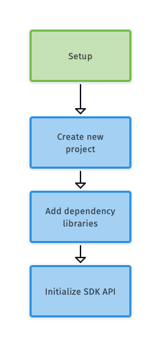

# Project Setup


 


1. Create new project
2. Add dependency libraries
3. Initialize SDK API (VCX library)

## 1. Create new project

### iOS 

- Create a new Xcode project using the Xcode new project: 
- From the template list choose **Single View App** and press **Next**
- Enter product name of your choice and choose preferred language: **Objective C** or **Swift** (leave Use Core Data unchecked)
- From new window, choose folder where you would like to store your project and press **Create**
- In a terminal navigate to chosen directory and it should contains the [project_name].xcodeproj file or the [project_name].xcworkspace file of your Xcode project. This will be referred as **project directory**.

 > in terminal app: 

```   
cd [chosen directory path]
ls -l
```

### Android

- You should have an existing Android Studio project or create a new Android Studio project using the Android Studio new project wizard. Instructions are available        <a href='https://developer.android.com/training/basics/firstapp/creating-project' target="_blank">here</a>
- During the setup of the project you can choose either Java or Kotlin as the language for your new project.

## 2. Add dependency libraries

### iOS

- If you do not already have a Podfile in the project directory then run the command ‘pod init’(If you don't have Cocoapods, install it:  ‘sudo gem install cocoapods’ )
- You should now have a Podfile in the project directory. We need to edit the Podfile and make sure it contains the following: 

 > in podfile mobile-starter-master/ios/CMeSdkObjc/Podfile:


```Ruby

# Uncomment the next line to define a global platform for your project
# platform :ios, '9.0'
source 'https://github.com/CocoaPods/Specs.git'
source 'https://github.com/evernym/indy-sdk.git'

def vcx_version_for_debug_or_release
	if ENV['CONNECTME_DEBUG'] == "true"
	  '0.0.102'
	else
	  '0.0.101'
	end
end
```

We also need to make sure the Podfile contains the following for your project:
- pod 'vcx', vcx_version_for_debug_or_release and 
- pod ‘Firebase/Analytics’ and pod ‘Firebase/Messaging’

So final Podfile should look like this: 

```Ruby
platform :ios, '10.0'

source 'https://github.com/CocoaPods/Specs.git'
source 'https://github.com/evernym/indy-sdk.git'

def vcx_version_for_debug_or_release
    if ENV['CONNECTME_DEBUG'] == "true"
        '0.0.102'
    else
        '0.0.101'
    end
end

target '[ProjectName]' do
  # Comment the next line if you don't want to use dynamic frameworks
  #use_frameworks!

  # Pods for Connect.Me SDK Sample
  pod 'vcx', vcx_version_for_debug_or_release
  pod 'Firebase/Analytics'
  pod 'Firebase/Messaging'

  target 'Connect.Me SDK SampleTests' do
    inherit! :search_paths
    # Pods for testing
  end

  target 'Connect.Me SDK SampleUITests' do
    # Pods for testing
  end

end


```

- Run `pod repo update`
- Since cocoapod is pointing to Evernym’s private repository. Developers outside Evernym network won’t have access to it. For developers outside Evernym network, one way we can follow is:
    - Get cocoapod zip file from someone inside Evernym
    - Go to ~/.cocoapods/repos/
    - Go to evernym repo directory
    - Inside evernym repo directory, go to, “Specs/vcx/0.0.102” (Do this as well to Specs/vcx/0.0.101)
      Open vcx.podspec in a text editor
    - Change s.source to point to your own http server instead of Evernym’s private repo
    - You can run your simple http server by installing an npm module http-server
        - `npm i -g http-server`
        - `cd \<directory-of-cocoapod-zip>`
            - http-server -p 1990
    - Now command `pod install` command should run successfully

- Now you can run the following command in a terminal after you cd to the project directory which contains the Podfile you just modified: ‘pod install’ or ‘CONNECTME_DEBUG=true pod install’
	

Settings for CococaPods environment:

- `Pod install` will hit 0.0.101 
- `CONNECTME_DEBUG=true pod install` will hit 0.0.102


Now make sure that the file [project_name].xcworkspace exists in the project directory and ONLY use that file to open your project and edit your source code in Xcode.   Do NOT use the [project_name].xcodeproj file any longer BUT don’t delete it either.   

If you are using Swift then you must create an Objective-C bridging header file named [project_name]-Bridging-Header.h in the same directory as your AppDelegate.swift file and add it to your Xcode project. The easiest way to do this is to use the File -> New -> File… menu item of the Xcode IDE. 

In the wizard that launches make sure to select iOS and then ‘Header File’ and then click the ‘Next’ button. In the ‘Save As:’ text field enter [project_name]-Bridging-Header.h and select the [project_name] ‘Group’ and select the [project_name] ‘Targets’ and click the Create button. Now the file [project_name]-Bridging-Header.h should be listed in the Xcode IDE at the same level as the AppDelegate.swift file. 

Edit the [project_name]-Bridging-Header.h file in the Xcode IDE and make sure it has at least the following: 

> in mobile-starter-master/ios/CMeSdkSwift/CMeSdkSwift/CMeSdkSwift-Bridging-Header.h


```ObjC
#ifndef [ProjectName]_Bridging_Header_h
#define [ProjectName]_Bridging_Header_h

#import "vcx/vcx.h"

#endif /* [ProjectName]_Bridging_Header_h */

```

- If you are using Objective-C then edit your AppDelegate.h file and add the following to the imports section of the file:

> in mobile-starter-master/ios/CMeSdkObjc/CMeSdkObjc/AppDelegate.h

```ObjC
#import "vcx/vcx.h"
```

### Android

- Open the Project level build.gradle file that contains the declaration of the repositories and add the following to the allprojects repositories section (not the         buildscript repositories section).
    
```java
maven {
    url 'https://evernym.mycloudrepo.io/public/repositories/libvcx-android'
}
```

- Now open the app level build.gradle file and add the following to the dependencies section.

```java
implementation 'com.evernym:vcx:0.2.43551129-6fc40e0@aar'
```

- Also, in the app level build.gradle file change minSdkVersion to be at least 23 rather than any smaller version number.
- Now you should try to build your project in Android Studio to make sure the changes you have made so far are correct. I would also recommend that you launch your mobile app in an emulator to make sure that the bundling of the apk is working.

## 3. Initialize SDK API

### iOS

-  ‘self.sdkApi’ and ‘self.sdkInited’. These Two AppDelegate data members need to be declared in the AppDelegate.h file and then initialized in the AppDelegate.m file.     

Here is the declaration for the AppDelegate.h file.
```c
        @property (strong, nonatomic) ConnectMeVcx *sdkApi;
        @property (nonatomic) BOOL sdkInited;
```

- Here is a synthesize statement to add to the AppDelegate.m file and the constructor or initer to be placed in the AppDelegate.m file. 
```c 

        @synthesize sdkInited;

        //
        // further down in AppDelegate.m
        // ...
        - (id)init
        {
        self = [super init];
        if (self) {
            // Initialization code here.
            self.sdkApi = [[ConnectMeVcx alloc] init];
            self.sdkInited = false;
        }

        return self;
        }
```        

- Now you should try to build your project in Xcode to make sure the changes you have made so far are correct. I would also recommend that you launch your mobile app in   a simulator to make sure that the linking and deploying steps work as well.  
- You are now ready to start adding calls to your code to [initialize the wallet](#Initializing-the-Wallet). 

### Android

- You should have an existing Android Studio project or create a new Android Studio project using the Android Studio new project wizard. Instructions are available        <a href='https://developer.android.com/training/basics/firstapp/creating-project' target="_blank">here</a>
- During the setup of the project you can choose either Java or Kotlin as the language for your new project.
- Open the Project level build.gradle file that contains the declaration of the repositories and add the following to the allprojects repositories section (not the buildscript repositories section).
    
```java
maven {
    url 'https://evernym.mycloudrepo.io/public/repositories/libvcx-android'
}
```
    
- Now open the app level build.gradle file and add the following to the dependencies section.

```java
implementation 'com.evernym:vcx:0.2.43551129-6fc40e0@aar'
```

- Also, in the app level build.gradle file change minSdkVersion to be at least 23 rather than any smaller version number.
- Now you should try to build your project in Android Studio to make sure the changes you have made so far are correct. I would also recommend that you launch your mobile app in an emulator to make sure that the bundling of the apk is working.


- TODO: Initialize self.sdkApi and self.sdkInited for android?...  mobile-starter-master/android/CMeSdkJava/app/src/main/java/me/connect/sdk/java/MainActivity.java
