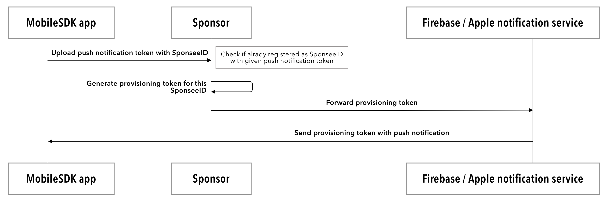

# 2. Initializing the Wallet and Cloud Agent

Almost all of the iOS APIs provided by mobile SDK are asynchronous, which means that a completion callback function is required to get the results of the function invocations. This page contains the steps to initialize the wallet and an Evernym Cloud Service cloud agent. Most of these wallet initialization steps are done in the AppDelegate’s `didFinishLaunchingWithOptions` lifecycle method. 

Android API are mostly asynchronous. It uses Java Future API, namely [android-retrofuture](https://github.com/retrostreams/android-retrofuture) implementation. Most of the methods returns `CompletableFuture` objects, that could be used both synchronous and asynchronous ways.

### Introduction
Using the Evernym mobile SDK currently requires that the SDK be connected to and rely on a cloud agent that is hosted and provisioned at Evernym. In the future, this Evernym cloud agent will be replaceable with your own, one from a different vendor but still usable with the Evernym mobile SDK. This agent is used for its store-and-forward services, persistence and availability and ability to push notify to a device or forward via http to the appropriate sponsor. By default, Evernym’s hosted cloud services are locked down. In order for your mobile SDK instance to prove that it has permission to provision a new hosted cloud agent (one unique cloud agent per installation of your mobile app), you must provide a token.

<!--This illustration is not helpful because it is not a decision tree-->

### Definitions
- Sponsor \
   You are the sponsor. You as the `Sponsor` are the application owner using the mobile sdk to `Sponsor` individual app installs e.g. Example Credit Union is the `Sponsor` using the Evernym mobile SDK inside their own mobile app. Also `Sponsor` should have backend server that will perform token issuing. A sponsor provides a provision token so that their customers can provide authorization with Evernym's cloud agent. 
>   **Example** Credit Union is the Sponsor using the Evernym mobile SDK inside their own mobile app.

    
- Sponsee \
    Your customer's individual App installation on mobile device.
>   **Example**  The app on Ryan’s phone is a Sponsee. He is an Example Credit Union member installing Example CU’s mobile app (`Sponsor`)  

- Evernym Cloud Service \
    Evernym hosted cloud service which facilitates provisioning and management of cloud agents - Evernym tokenizer service, provisioning protocol, agent management for all other protocols

- Provision Token \
    This token is provided by you as a `Sponsor` to enable provisioning of one of your customers (`Sponsee`) on an Evernym hosted cloud agent.
    ```json
     {
       "sponseeId":     String,
       "sponsorId":     String,
       "nonce":         String,
       "timestamp":     String,
       "sig":           String,
       "sponsorVerKey": String,
     } 
    ```

#### Token Fields 
* `sponseeId`:
 An identifier you as a `Sponsor` use to identify/reference your customer the `Sponsee`. This can be a customer id used to identify the customer (`Sponsee`) in your (`Sponsor`) back end database. In other words, this is an ID of an app user.
* `sponsorId`: 
 An ID given to you from Evernym's Support Team after the `Sponsor` onboarding process is complete.  
* `nonce`:
Randomly generated string. Used as one-time security token during registration. \
**Example**. `random.number.toString()`
* `timestamp`:
An RFC 3339 and ISO 8601 date and time string such as `1996-12-19T16:39:57-08:00`.
* `sig`:
You will provide a signature to your customer (the `Sponsee`) so that they can provision with Evernym's Cloud Agent. You (The `Sponsor`) will:  
    1. create a string by concatenating in this order `nonce + timeStamp + sponseeId + sponsorId`
    2. sign the resulting string with the keys registered during the onboarding process. The keys that match the configured `sponsorVerKey`. 
    3. Base64 encode the result of the signature
**Example** Base64Encode(Sign(nonce + timeStamp + sponseeId + sponsorId))
* `sponsorVerKey`: 
This is the key you as the `Sponsor` provided to Evernym's support team during onboarding. You (`Sponsor`) can register multiple keys during onboarding so this identifies which key to use during authorization. This key is not used unless a corresponding one is found in the configuration.

Simple server performing provision token signing and provision token generation could be found [here](https://github.com/evernym/mobile-sdk/tree/android-provisioning-update/simple-sponsor).
> **NOTE:** Current android sample does not contain code for token provisioning

- VCX Config: The list of options can be set in the config JSON passed to `vcx_get_provision_token` and `vcx_provision_agent_with_token` functions
    can be found in [the document](./Configuration.md).

### Your Sponsor Onboarding with Evernym's Cloud Service
- In order for you to register as a `Sponsor`, contact `support@evernym.com`.
- Onboarding/Registration requires you (the `Sponsor`) to provide these attributes to Evernym's support team. Please include them in your email to support@evernym.com: 
    1. Name you want for your onboarded sponsor 
    2. Verification Keys: List (1 or many) of your `Sponsor` VerKeys associated with the signing of the token. This is used to verify and authenticate a customer's (`Sponsee`) provision token during the provisioning on Evernym's Cloud Service. 
                               - The signing keys (including the `verkey` shared with Evernym's Cloud Service) can be generated using this simple tool: `https://github.com/sovrin-foundation/launch/raw/master/sovrin-keygen.zip` 
                               - The Private keys need to be stored in a safe place under control your (`Sponsor's`) control. 
                               - The public `verkey` will be shared with Evernym for signature validation.
    3. endpoint: Your (`Sponsor's`) URL that Evernym Cloud Service should forward customer (`Sponsee`) messages to. This is how you will add push notifications to your mobile app. Evernym does not host a push notification service for the mobile SDK, you must create and manage your own. Evernym cloud agents will forward messages to this endpoint for you to push notify to your app. \
    
### Mobile SDK Customer Provisioning
1. Obtaining Provision Token
    - You as the `Sponsor` will need to sign a provision token for your customer (`Sponsee`). An app will have to communicate with you (`Sponsor`) to receive a `token`. 
    - This `token` will contain a signature generated by you (`Sponsor`) to ensure the customer's provisioning application (`Sponsee`) has authorization to do so.
    - The `sig` field in [Token Fields](2.%20Initialization.md#token-fields) describes how to sign a token. 
    - It also contains a timestamp. If the token isn’t delivered to Evernym's Cloud Service in a predefined time frame, the token will be invalid. Your customer (`Sponsee`) will need to request another `token` from you (`Sponsor`).
    - If for whatever reason provisioning fails, the customer (`Sponsee`) should request a new `token` from you (`Sponsor`) and attempt provisioning again. 
2. Provisioning
    - Provisioning version 0.7 needs to be used for this. 
    - If a wallet is already configured before the provision, this wallet will be used. If not, a new one will be created.
    - The configuration returned from this api will be the input for `vcx_init`. At this point, the app will be provisioned on Evernym's Cloud Service with a cloud agent and will have a local wallet initialized but NOT open. `Vcx_init` will open the wallet.

3. Receiving Future Messages
    - The customer's application (`Sponsee`) will need to call update_com_method (`UtilsApi.vcxUpdateAgentInfo` in mobile-sdk) \
      `id`: String - `Sponsee's` Id, \
      `type`: Int - Com Method Type (ALWAYS `3` for forwarding), \
      `value`: String 
      - The customer's `Sponsee's` messages are forwarded to you (the `Sponsor`). `value` will be the whatever information your (`Sponsor's`) back-end will need to deliver that message to the customer (`Sponsee`). You will receive this `value` in the field `sponseeDetails` in the message from CAS. 
      - When Evernym's Cloud Service receives a message for this entity (through provisioned cloud agent), the cloud agent will forward the message to you (`Sponsor`) at whichever endpoint that was provided during [Onboarding](2.%20Initialization.md#your-sponsor-onboarding-with-evernyms-cloud-service). \
        You (`Sponsor`) will the deliver the message to your customer (`Sponsee`) with whatever mechanism you already use to communicate with your customer (`Sponsee`).  
    - The cloud agent will forward messages to you (the `Sponsor's`) back-end vi http. No A2A encryption will be added. The http message will include:
        1. `msgId`:  This is the id that your customer (`Sponsee`) will use to actually download the message
        2. `sponseeDetails`: You (`Sponsor`) will be forwarded your customer's `Sponsee` messages. This will be the whatever information your (the `Sponsor's`) back-end will need to deliver that message to the customer (`Sponsee`). Contains the `value` that you sent into `update_com_method`. 
        3. `relationshipDid` - My DID - the specific relationship I'm interacting on.  
        4. `metaData` - message type and sender's name. This is used mostly to display the message for the customer (`Sponsee`). These values are optional from the sender's perspective.
        ```json 
       {
         msgId: String,
         sponseeDetails: String, 
         relationshipDid: String,
         metaData: {
           msgType: String,
           msgSenderName: String,
         }
       } 
        ```
    - You (`Sponsor`) will then push notify the customer (`Sponsee`) informing that a message is available and ready to be downloaded from the customer's (`Sponsee's`) cloud agent. 

### iOS
Refer to [AppDelegate.m](mobile-starter-master/ios/CMeSdkObjc/CMeSdkObjc/AppDelegate.m).

### Android
Refer to [ConnectMeVcx#init()](Examples/android/CMeSdkJava/lib/src/main/java/me/connect/sdk/java/ConnectMeVcx.java#L65). 
1.  libVcx uses `slf4j` logging library. \
    Sample of configuration to store libVcx logs in specified file could be found [here](Examples/android/CMeSdkJava/lib/src/main/java/me/connect/sdk/java/ConnectMeVcx.java#L114).\
    For additional information about logging configuration see [slf4j documentation](http://www.slf4j.org/docs.html).

2. Genesis transaction pool used to configure network could be found [here](Examples/android/CMeSdkJava/app/src/main/java/me/connect/sdk/java/sample/Constants.java#L5). This configuration targets *production* network.\ 
    In case your app works with other network, corresponding genesis transaction files for different environment could be found
[here](https://github.com/sovrin-foundation/sovrin/tree/master/sovrin). 
    This files should be saved on filesystem and be accessible to libVcx. For sample, [ConnectMeVcx#writeGenesisFile()](Examples/android/CMeSdkJava/lib/src/main/java/me/connect/sdk/java/ConnectMeVcx.java#L150).

3. On first init (if you don't have populated JSON config) following steps shoud be performed:

    1. Create directory where wallet will be located.

    2. Generate wallet key. See [ConnectMeVcx#createWalletKey()](Examples/android/CMeSdkJava/lib/src/main/java/me/connect/sdk/java/ConnectMeVcx.java#L186).

    3. Prepare agency configuration JSON using wallet name, key and wallet directory path (see [config sample](#config-sample)).

    4. Call `UtilsApi#vcxAgentProvisionAsync()` with prepared config to fill necessary fields.

    5. Add additional fields to resulting JSON (see [ConnectMeVcx#populateConfig()](Examples/android/CMeSdkJava/lib/src/main/java/me/connect/sdk/java/ConnectMeVcx.java#L138)) and store resulting JSON string for latter usage. On second and other inits that JSON will be used to initialize libVcx. This JSON should be securely stored.
    

4. Call `VcxApi#initSovToken()` to initialize libVcx. In case return code is not `0` , you should call `VcxApi#vcxInitWithConfig(config)` with config created on step _#3.5_


> **NOTE:** If the initialization of the wallet does not work after you followed these steps, please contact Evernym. If you had to do extra steps to get it working, please also let us know what you had to do so that we can update this document.


## Selecting the Ledger and Cloud Service

#### Ledger

If you want to use a different Ledger, you *must* change to the corresponding Evernym Cloud Service as described in the *Evernym Cloud Service* section below.

1. Change the agency configuration object according to Ledger you want to use. Evernym has several active Ledger instances, but in most cases you will use one of these two: 
	- [**`demo`**](DemoEnvironment.md): for testing purposes during development and
	- [**`prod`**](ProductionEnvironment.md): production environment, for app releases in AppStores.


2. Use the `poolConfig:` setting in the particular environment to set the `poolTxnGenesis` variable to the value of the `poolConfig:` setting. If you  want to use a different Ledger other than `demo`, which is what the above code uses, then please let us know. <!--[Q5] Do they need to ask Evernym for permission or instructions to use a different Ledger, or do they talk to us if they want to use a different Ledger than in the list in Step 1?-->

#### Evernym Cloud Service

If you choose to use a different Ledger then you *must* change to the corresponding Evernym Cloud Service and vice-versa. 

* To use a different Evernym Cloud Service, change the contents of the `agencyConfig` variable in the above code. 

* For every different Ledger configuration there is a corresponding Evernym Cloud Service configuration. These configuration settings can be seen in the same `config-store.js` code that was linked in the Ledger section above. 

* You will need to change `agency_did`, `agency_url`, and `agency_verkey` in the code above to use a different Evernym Cloud Service for the corresponding Ledger.

<a id="config-sample"></a>

### Agency config sample

```json
{
    // These fields are used for agency configuration
    "agency_url": "http://agency.evernym.com", // URL of agency to use
    "agency_did": "DwXzE7GdE5DNfsrRXJChSD", // DID of agency
    "agency_verkey": "844sJfb2snyeEugKvpY7Y4jZJk9LT6BnS6bnuKoiqbip", // Verification key of the agency

    //These fields are used for wallet configuration
    "wallet_name": "name", // Name of the wallet
    "wallet_key": "key", // Wallet key
    "storage_config": { // Wallet storage config
        "path": "/path/to/wallet", // Path to the wallet directory
    }
}
```

### Android

Android sample app contains ready for use genesis pool configurations available in [raw resource directory](Examples/android/CMeSdkJava/app/src/main/res/raw).

## Sponsor provisioning overview

### First run - standard push notification flow


### App start - user accepted push notification flow


### APP running after uploading push token to sponsor web service


## Push notifications setup

For in more depth information how push notifications works in one of the platforms, you can read official documentation sections for: 
   
   - Android: [https://developer.android.com/guide/topics/ui/notifiers/notifications](https://developer.android.com/guide/topics/ui/notifiers/notifications)
   - iOS: [https://developer.apple.com/documentation/usernotifications/](https://developer.apple.com/documentation/usernotifications/)


From Vcx and cloud agent perspective, you will need to link received **push notification token** you received on your device with your cloud agent in Vcx, so notifications will be sent to correct device. 

We also recommend using Firebase Cloud Messaging, since it's provide universal configuration for both platforms (iOS and Android): https://firebase.google.com/docs/cloud-messaging/android/client. 

How to link your push notification with VCX cloud agent? 

For the moment, sending push notifications should happen from user's cloud agent (which will receive notification from Evernym cloud agent) so all mobile device tokens are stored on your side, safely and securely.

We are working also on improving service related to push notifications, we should have more details soon. 

## Receiving push notifications on mobile device

In meantime, you can use method ```downloadMessages``` in ObjC or ```UtilsApi.vcxGetMessages``` in Java, for pulling all messages waiting on cloud agent. Parameters for this method are as follows:
```
messageStatus: optional, comma separated - query for messages with the specified status.
  Statuses:
   MS-101 - Created
   MS-102 - Sent
   MS-103 - Received
   MS-104 - Accepted
   MS-105 - Rejected
   MS-106 - Reviewed

uids: optional, comma separated - query for messages with the specified uids.

pwdids: optional, comma separated - DID's pointing to specific connection.
```

This returns a JSON object which can be parsed into an array of messages, each of which contains a JSON object that itself can be parsed into the message payload.

 ObjC
 
```objc
[appDelegate.sdkApi downloadMessages:@"MS-103" uid_s:nil pwdids:pw_did completion:^(NSError *error, NSString *messages) {
}
```

<!-- After wallet initialization Vcx with specific configuration (steps from above), you just need to call a method **updateAgentInfo** and provide details of your deviceID and push notification token, in this format: 

```
   { uniqueId: '{deviceID}', pushToken: 'FCM:{pushToken}' }
``` -->

<!-- ### iOS: 

> In same file with wallet initialization steps, eg. AppDelegate.m 

```ObjectiveC
[appDelegate.sdkApi agentUpdateInfo:pushNotifConfig completion:^(NSError *error) {
   if (error != nil && error.code != 0)
   {
         NSString *indyErrorCode = [NSString stringWithFormat:@"%ld", (long)error.code];
         NSLog(@"3) Value of indyErrorCode is: %@", indyErrorCode);
   } else {
         NSLog(@"Updated the push notification token to: %@", tokenString);
   }
}];
``` -->

<!-- ### Android: 

> In same file with wallet initialization steps, eg. ConnectMeVCX.java -->

<!-- ```java
UtilsApi.vcxUpdateAgentInfo(config).exceptionally((t) -> {
   promise.reject("FutureException", t.getMessage());
      return -1;
   }).thenAccept(result -> {
   if (result != -1) {
      BridgeUtils.resolveIfValid(promise, result);
   }
});
``` -->
