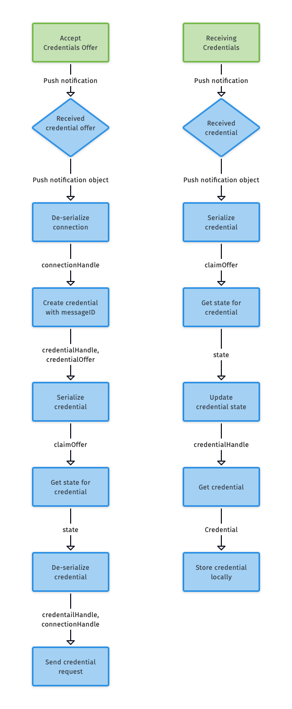

# 4. Credentials

To receive and store a credential locally, two processes must be completed:

1. [Accept the credential offer](#Accept-the-credential-offer)

    1. Receive the push notification from the Issuer.
    2. Deserialize the connection.
    3. Create the credential with a message ID.
    4. Serialize the credential.
    5. Get the state for the credential.
    6. Deserialize the credential.
    7. Send the credential request.

2. [Receive and generate the credential](#Receive-and-generate-the-credential)
    1. Receive the credential.
    2. Serialize the credential.
    3. Get the state for the credential.
    4. Update the credential state.
    5. Get the credential.
    6. Store the credential locally.


<!--### Credentials Flow
** This illustration makes sense because it shows a process. However, the Received Credential [Offer] diamond doesn't show decisions branching off it. Bonnie will create a new version.-->

--- 
## Accept the credential offer

After receiving a push notification with the credential-offer object, the process follows these next steps to accept the credential offer:

### 1. Deserialize the connection

<!--[Q1] Please provide a short explanation of how/why the system deserializes the connection. One or two sentences. Please be sure to specify which component of the system is performing the action, e.g., "The mobile app sends..." or "The user enters..."-->

##### iOS

<!--[Q2] Where is this code visible?-->

```ObjC
[[sdkAPI] connectionDeserialize: serializedConnection completion:^(NSError *error, NSInteger connectionHandle) {
// handle errors first
}
```


#### Android

<!--[Q3] Where is this code visible?-->

```java
ConnectionApi.connectionDeserialize(serializedConnection)
    .exceptionally((t) -> {
        // handle error response
        return -1;
    }).thenAccept(result -> {
        if (result != -1) {
            // handle successful result
        }
    });
```


### 2. Create the credential with a `messageID`

<!--[Q4] Please provide a short explanation of how/why the system creates a credential with a messageID.-->

#### iOS 

<!--[Q5] Where is this code visible?-->

```ObjC 
[[sdkAPI] credentialCreateWithMsgid: messageId 
    connectionHandle: (int)connectionHandle 
    msgId: messageId 
    completion: ^(NSError *error, NSInteger credentialHandle, NSString* credentialOffer) {
    // handle errors first
    //... proceed with next step
}
```

#### Android

<!--[Q6] Where is this code visible?-->

```java
CredentialApi.credentialCreateWithMsgid(sourceId, connectionHandle, messageId)
    .exceptionally((t) -> {
        // handle error response
        return null;
    }).thenAccept(result -> {
        GetCredentialCreateMsgidResult typedResult = (GetCredentialCreateMsgidResult) result;
        WritableMap vcxCredentialCreateResult = Arguments.createMap();
        vcxCredentialCreateResult.putInt("credential_handle", typedResult.getCredential_handle());
        vcxCredentialCreateResult.putString("credential_offer", typedResult.getOffer());
        // handle successful result
    });
```


### 3. Serialize the credential

<!--[Q7] Please provide a short explanation of how/why the system serializes the credential-->

#### iOS 

<!--[Q8] Where is this code visible?-->

```ObjC
[[sdkAPI] credentialSerialize:credentialHandle 
    completion:^(NSError *error, NSString *claimOffer) {
// handle errors first
//... proceed with next step
}
```


#### Android

<!--[Q9] Where is this code visible?-->

```java
CredentialApi.credentialSerialize(credentialHandle)
    .exceptionally((t) -> {
        // handle error response
        return null;
    }).thenAccept(result -> {
        // handle successful result
    });
```

### 4. Get the state for the credential 

<!--[Q10] Please provide a short explanation of how/why the system gets the state for the credential.-->

#### iOS 
<!--[Q11] Where is this code visible?-->

```ObjC
[[sdkAPI] credentialGetState:credentialHandle 
    completion:^(NSError *error, NSInteger state) {
// handle errors first
//... proceed with next step
}
```


#### Android

<!--[Q12] Where is this code visible?-->

```java
CredentialApi.credentialGetState(credentialHandle)
    .exceptionally((t) -> {
        // handle error response
        return -1;
    }).thenAccept(result -> {
        if (result != -1) {
        // handle successful result
        }
    });
```

### 5. Deserialize the credential

<!--[Q13] Please provide a short explanation of how/why the system deserializes the credential-->

#### iOS 

<!--[Q14] Where is this code visible?-->

```ObjC
[[sdkAPI] credentialDeserialize: serializedCredential_cString 
    completion: ^(NSError *error, NSInteger credentialHandle) {
// handle errors first
//... proceed with next step
}
```


#### Android

<!--[Q15] Where is this code visible?-->

```java
CredentialApi.credentialDeserialize(serializedCredential)
    .exceptionally((t) -> {
        // handle error response
        return -1;
    }).thenAccept(result -> {
        if (result != -1) {
            // handle successful result
        }
    });
```

### 6. Send the credential request 

<!--[Q16] Please provide a short explanation of how/why the system sends the credential request-->

#### iOS 

<!--[Q17] Where is this code visible?-->

```ObjC
[[sdkAPI] credentialSendRequest: credentialHandle connectionHandle: (int)connectionHandle paymentHandle: 0 completion: ^(NSError *error) {
// handle errors first
//... proceed with next step
}
```

#### Android

<!--[Q18] Where is this code visible?-->

```java
CredentialApi.credentialSendRequest(credentialHandle, connectionHandle, paymentHandle)
    .exceptionally((t) -> {
        // handle error response
        return null;
    }).thenAccept(result -> {
        // handle successful result
    });

```
---
## Receive and generate the credential


### 1. Serialize the credential

<!--[Q19] Please provide a short explanation of how/why the system serializes the credential-->

#### iOS 

<!--[Q20] Where is this code visible?-->

```ObjC
[[sdkAPI]  credentialSerialize:credentialHandle completion:^(NSError *error, NSString *claimOffer) {
// handle errors first
//... proceed with next step
}
```

#### Android

<!--[Q21] Where is this code visible?-->

```java
 CredentialApi.credentialSerialize(credentialHandle)
    .exceptionally((t) -> { 
        // handle error response
        return null;
    }).thenAccept(result -> {
        // handle successful result
    });

```

### 2. Get the state for the credential

<!--[Q22] Please provide a short explanation of how/why the system gets the state for the credential-->

#### iOS 

<!--[Q23] Where is this code visible?-->

```ObjC
[[sdkAPI]  credentialGetState:credentialHandle completion:^(NSError *error, NSInteger state) {
// handle errors first
//... proceed with next step
}
```


#### Android

<!--[Q24] Where is this code visible?-->

```java
CredentialApi.credentialGetState(credentialHandle)
    .exceptionally((t) -> {
        // handle error response
        return -1;
    }).thenAccept(result -> {
        if (result != -1) {
            // handle successful result
        }
    });
```

### 3. Update the credential state

<!--[Q25] Please provide a short explanation of how/why the system updates the credential state-->

#### iOS 

<!--[Q26] Where is this code visible?-->

```ObjC
[[sdkAPI] credentialUpdateState: credentialHandle completion: ^(NSError *error, NSInteger state) {
// handle errors first
//... proceed with next step
}
```

#### Android

<!--[Q27] Where is this code visible?-->

```java
CredentialApi.credentialUpdateState(credentialHandle)
    .exceptionally((t) -> {
        // handle error response
            return -1;
    })
    .thenAccept(result -> {
        if (result != -1) {
            // handle success message
        }
    });
```

### 4. Get the credential 

<!--[Q28] Please provide a short explanation of how/why the system gets the credential-->

#### iOS 
<!--[Q29] Where is this code visible?-->

```ObjC
[[sdkAPI] getCredential: credentialHandle completion: ^(NSError *error, NSString *credential) {
// handle errors first
...
}
```

#### Android

<!--[Q30] Where is this code visible?-->

```java
CredentialApi.getCredential(credentialHandle)
    .exceptionally((t) -> {
        // handle error response
        return null;
    }).thenAccept(result -> {
        // handle success message
    });
```

When the process has finished, you can store the credential locally on the user device. <!--[Q31] How is this done?-->
