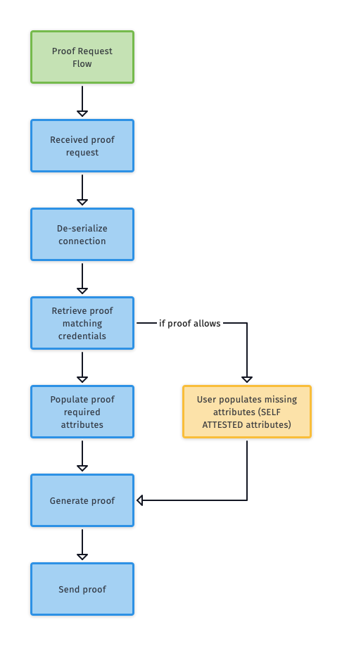

# 6. Proof Request Flow

To successfully fill and sign a proof request, the following process must be completed: <!--The other docs don't have a TOC with this level of detail.-->


- [Proof request flow](#proof-request-flow)
  - [Proof request flow](#proof-request-flow-1)
  - [1. Download messages and filter objects of type `proofReq`](#1-download-messages-and-filter-objects-having-type-proofreq)
    - [iOS](#ios)
    - [Android](#android)
    - [Javascript](#javascript)
  - [2. Deserialize connection and get connection handle](#2-deserialize-connection-and-get-connection-handle)
    - [iOS](#ios-1)
    - [Android](#android-1)
    - [iOS](#ios-2)
    - [JSON example](#json-example)
  - [3. Create proof with message ID](#3-create-proof-with-message-id)
    - [iOS](#ios-3)
    - [Android](#android-2)
  - [4. Retrieve proof matching credentials](#4-retrieve-proof-matching-credentials)
    - [Example of autofilled attribute from credential:](#example-of-autofilled-attribute-from-credential)
    - [Retrieved credentiials JSON example:](#retrieved-credentiials-json-example)
    - [iOS](#ios-4)
    - [Android](#android-3)
  - [5. Fill missing - self attested attributes](#5-fill-missing---self-attested-attributes)
    - [Self attested attributes example:](#self-attested-attributes-example)
    - [iOS](#ios-5)
    - [Android](#android-4)
  - [5. Generate proof](#5-generate-proof)
    - [iOS](#ios-6)
    - [Android](#android-5)
  - [6. Sending proof](#6-sending-proof)
    - [iOS](#ios-7)
    - [Android](#android-6)
  - [Bonus: Complete flow in Javascript: step by step](#bonus-complete-flow-in-javascript-step-by-step)

--- 

## Proof Request Flow
<!--This illustration has a decision tree but it doesn't use the diamond.-->

--- 
## 1. Download messages and filter objects of type `proofReq`

Call `downloadMessages('MS-103', null, pwDID)` and filter objects <!--Do we call two things, the first item and "filter objects", or do we call the thing and then filter some objects?-->having type `proofReq`. From there use `decryptedPayload` and the `uid` from the object.

Example of the proof-request message object in JSON: 

```json
{
    "decryptedPayload": "{\"@type\":{\"name\":\"PROOF_REQUEST\",\"ver\":\"1.0\",\"fmt\":\"json\"},\"@msg\":\"{\\\"@type\\\":{\\\"name\\\":\\\"PROOF_REQUEST\\\",\\\"version\\\":\\\"1.0\\\"},\\\"@topic\\\":{\\\"mid\\\":0,\\\"tid\\\":0},\\\"proof_request_data\\\":{\\\"nonce\\\":\\\"220867029780621153091790\\\",\\\"name\\\":\\\"Basic Info\\\",\\\"version\\\":\\\"0.1\\\",\\\"requested_attributes\\\":{\\\"Number\\\":{\\\"name\\\":\\\"Number\\\"},\\\"First Name\\\":{\\\"name\\\":\\\"First Name\\\"},\\\"Last Name\\\":{\\\"name\\\":\\\"Last Name\\\"},\\\"Color\\\":{\\\"name\\\":\\\"Color\\\"},\\\"Job Title\\\":{\\\"name\\\":\\\"Job Title\\\"}},\\\"requested_predicates\\\":{},\\\"non_revoked\\\":null},\\\"msg_ref_id\\\":null,\\\"from_timestamp\\\":null,\\\"to_timestamp\\\":null,\\\"thread_id\\\":null}\"}",
    "deliveryDetails":[],
    "payload":null,
    "refMsgId": null,
    "senderDID" : "JFatV7UCKPsSTqDBDAUBiN",
    "statusCode": "MS-103",
    "type":"proofReq",
    "uid":"OWY3MDd"
}

```

### iOS

<!--Need some sherpa notes for these code blocks.-->

```ObjC
[[sdkAPI] downloadMessages:@"MS-103" uid_s:nil pwdids:pw_did completion:^(NSError *error, NSString *messages) {
    NSMutableArray *myMessages = [NSJSONSerialization JSONObjectWithData:[messages dataUsingEncoding:NSUTF8StringEncoding] options:NSJSONReadingMutableContainers error:&error];
    // filter myMesssages to type = proofReq
    for(NSDictionary *item in myMessages) {
        for(NSDictionary *msg in item[@"msgs"]) {
            if ([msg[@"type"] isEqualToString: @"proofReq"]) {
                 /// continue with next step
            }
        }
    }
}
```

### Android

```java
LibVCXApi.vcxGetMessages(messageStatus, uid_s, pwdids)
    .exceptionally((t) -> {
        // handle error result
        return null;
        })
    .thenAccept(result -> {
        // handle successful result
    });
```


### Javascript 

```javascript
const MESSAGE_PENDING = 'MS-103';
// Get messages will have type 'profReq'
const downloadMessages = await RNIndy.downloadMessages(
    MESSAGE_PENDING,
    null,
    this.props.connection.pwDid,
);

const msgObject = JSON.parse(downloadMessages)[0]
```

---

## 2. Deserialize the connection and get the connection handle

Once we get proof object from agency, we need to use proof **requestedAttributes** and fill it with our automated data from certificate(s) or manually (self attested attributes)


### iOS
```ObjC
[[sdkAPI] connectionDeserialize: serializedConnection completion:^(NSError *error, NSInteger connectionHandle) {
// handle errors first
}
```

### Android

```java
ConnectionApi.connectionDeserialize(serializedConnection)
    .exceptionally((t) -> {
        // hadle error response
        return -1;
    }).thenAccept(result -> {
        if (result != -1) {
            // hadle successful response
        }
    });
```

For the testing flow, use an example where the user provides these details: <!--Is this supposed to be a block of code or a bullet list?-->
	
* First Name
* Last Name
* Color <!--Color of what?-->
* Job Title
* Number

Original requested-attributes data will look like this in JSON: 

```json
    ...(rest proof request data)...
	  "requested_attributes": {
	        "First Name": {
	            "name": "First Name"
	        },
	        "Color": {
	            "name": "Color"
	        },
	        "Number": {
	            "name": "Number"
	        },
	        "Last Name": {
	            "name": "Last Name"
	        },
	        "Job Title": {
	            "name": "Job Title"
	        }
	   }
	   ...
```

After we serialize the proof request, request attributes should look like this for self-attested attributes: 

```json
    ...(rest proof request data)...
    "requested_attributes": [
        {
            "First Name": "fieldValue"
        },
        {
            "Color": "fieldValue"
        },
        {
            "Number": "fieldValue"
        },
        {
            "Last Name": "fieldValue"
        },
        {
            "Job Title": "fieldValue"
        }
    ]
    ...
```
    
### iOS

```objC
 [[sdkAPI] connectionDeserialize: serializedConnection completion:^(NSError *error, NSInteger connectionHandle) {
    
    NSMutableDictionary *decryptedPayloadMsg = [NSJSONSerialization JSONObjectWithData:[decryptedPayload[@"@msg"] dataUsingEncoding:NSUTF8StringEncoding] options:NSJSONReadingMutableContainers error:&error];
            
    NSDictionary *stringifiableProofRequestData = @{
        @"agent_did": @"",
        @"agent_vk": @"",
        @"link_secret_alias": @"main",
        @"my_did": @"",
        @"my_vk": @"",
        @"proof_request": decryptedPayloadMsg,
        @"source_id": messageId,
        @"state": @3,
        @"their_did": @"",
        @"their_vk": @""
    };
            
    NSDictionary *stringifiableProofRequest = @{
        @"data": stringifiableProofRequestData,
        @"version": decryptedPayloadMsg[@"@type"][@"version"]
    };
}];
```

As a result, the parsed object should have a structure like this: 

### JSON example

```json
 {
        "agent_did": "",
        "agent_vk": "",
        "link_secret_alias": "main",
        "my_did": "",
        "my_vk": "",
        "proof_request": {
            "@topic":{
                "mid": 0,
                "tid": 0,
            },
            "@type": {
                "name": "PROOF_REQUEST",
                "version": "1.0",
            },
            "from_timestamp": null,
            "msg_ref_id": null,
            "proof_request_data": {
                "name": "Basic Info",
                "non_revoked": null,
                "nonce": 220867029780621153091790,
                "requested_attributes": {
                    "Color": {
                        "name": "Color",
                    },
                    "First Name": {
                        "name": "First Name",
                    },
                    "Job Title": {
                        "name": "Job Title",
                    },
                    "Last Name": {
                        "name": "Last Name",
                    },
                    "Number": {
                        "name": "Number",
                    },
                },
                "requested_predicates": {},
                "version": "0.1",
            },
            "thread_id": null,
            "to_timestamp": null,
        },
        "source_id": "OWY3MDd",
        "state": 3,
        "their_did": "",
        "their_vk": "",
    },
    version: "1.0",
}
```
--- 


## 3. Create proof with a message ID

From the proof message object in the previous step you should have all of the necessary parts to generate the proof. The required attributes are: 
 
 - messageID
 - connectionHandle


### iOS

```objc
[[sdkAPI] 
    proofCreateWithMsgId: messageId
    withConnectionHandle: (unsigned int)connectionHandle 
    withMsgId: messageId 
    withCompletion: ^(NSError *error, vcx_proof_handle_t proofHandle, NSString *proofRequest) {              
 }
```
### Android

```java
DisclosedProofApi.proofCreateWithMsgId(sourceId, connectionHandle, messageId).
    exceptionally((t) -> {
        // handle errors
        return null;
    })
    .thenAccept(result -> {
        if (result != null) {
            CreateProofMsgIdResult typedResult = (CreateProofMsgIdResult) result;
            WritableMap vcxProofCreateResult = Arguments.createMap();
            vcxProofCreateResult.putInt("proofHandle", typedResult.proofHandle);
            vcxProofCreateResult.putString("proofRequest", typedResult.proofRequest);
            // handle successful result
        }
    });
```

--- 
## 4. Retrieve proof-matching credentials

Search for attributes in the accepted credentials with the same label, and autofill the given attribute with data from the matched credential:

### Example of an autofilled attribute from the credential: 

```json
	{
    "attrs": {
        "First Name": {
            "tails_file": null,
            "credential": {
                "cred_info": {
                    "cred_rev_id": null,
                    "cred_def_id": "AVLv6qDJKU22F22T18XD5x:3:CL:9001:tag1",
                    "schema_id": "AVLv6qDJKU22F22T18XD5x:2:Evernym Staging1539111153570:1.0",
                    "attrs": {
                        "First Name": "Predrag",
                        "Color": "bl",
                        "Number": "1",
                        "Last Name": "Jevtic",
                        "Job Title": "Dev"
                    },
                    "rev_reg_id": null,
                    "referent": "9d5902c7-326a-4761-87c1-bff2c40d940e"
                },
                "interval": null
            }
        }
    }
	}
```

To match some of the proof-request attributes, call the libVCX method `proofRequestCredentials`, which will retrieve all previously accepted credentials. 

### Retrieved credentials JSON example:

```json
{
    "attrs": {
        "First Name": {
            "tails_file": null,
            "credential": {
                "cred_info": {
                    "cred_rev_id": null,
                    "cred_def_id": "AVLv6qDJKU22F22T18XD5x:3:CL:9001:tag1",
                    "schema_id": "AVLv6qDJKU22F22T18XD5x:2:Evernym Staging1539111153570:1.0",
                    "attrs": {
                        "First Name": "Predrag",
                        "Color": "bl",
                        "Number": "1",
                        "Last Name": "Jevtic",
                        "Job Title": "Dev"
                    },
                    "rev_reg_id": null,
                    "referent": "9d5902c7-326a-4761-87c1-bff2c40d940e"
                },
                "interval": null
            }
        },
        "Color": {
            "tails_file": null,
            "credential": {
                "cred_info": {
                    "cred_rev_id": null,
                    "cred_def_id": "AVLv6qDJKU22F22T18XD5x:3:CL:9001:tag1",
                    "schema_id": "AVLv6qDJKU22F22T18XD5x:2:Evernym Staging1539111153570:1.0",
                    "attrs": {
                        "First Name": "Predrag",
                        "Color": "bl",
                        "Number": "1",
                        "Last Name": "Jevtic",
                        "Job Title": "Dev"
                    },
                    "rev_reg_id": null,
                    "referent": "9d5902c7-326a-4761-87c1-bff2c40d940e"
                },
                "interval": null
            }
        },
        "Number": {
            "tails_file": null,
            "credential": {
                "cred_info": {
                    "cred_rev_id": null,
                    "cred_def_id": "AVLv6qDJKU22F22T18XD5x:3:CL:9001:tag1",
                    "schema_id": "AVLv6qDJKU22F22T18XD5x:2:Evernym Staging1539111153570:1.0",
                    "attrs": {
                        "First Name": "Predrag",
                        "Color": "bl",
                        "Number": "1",
                        "Last Name": "Jevtic",
                        "Job Title": "Dev"
                    },
                    "rev_reg_id": null,
                    "referent": "9d5902c7-326a-4761-87c1-bff2c40d940e"
                },
                "interval": null
            }
        },
        "Last Name": {
            "tails_file": null,
            "credential": {
                "cred_info": {
                    "cred_rev_id": null,
                    "cred_def_id": "AVLv6qDJKU22F22T18XD5x:3:CL:9001:tag1",
                    "schema_id": "AVLv6qDJKU22F22T18XD5x:2:Evernym Staging1539111153570:1.0",
                    "attrs": {
                        "First Name": "Predrag",
                        "Color": "bl",
                        "Number": "1",
                        "Last Name": "Jevtic",
                        "Job Title": "Dev"
                    },
                    "rev_reg_id": null,
                    "referent": "9d5902c7-326a-4761-87c1-bff2c40d940e"
                },
                "interval": null
            }
        },
        "Job Title": {
            "tails_file": null,
            "credential": {
                "cred_info": {
                    "cred_rev_id": null,
                    "cred_def_id": "AVLv6qDJKU22F22T18XD5x:3:CL:9001:tag1",
                    "schema_id": "AVLv6qDJKU22F22T18XD5x:2:Evernym Staging1539111153570:1.0",
                    "attrs": {
                        "First Name": "Predrag",
                        "Color": "bl",
                        "Number": "1",
                        "Last Name": "Jevtic",
                        "Job Title": "Dev"
                    },
                    "rev_reg_id": null,
                    "referent": "9d5902c7-326a-4761-87c1-bff2c40d940e"
                },
                "interval": null
            }
        }
    }
	}
```

### iOS
	
```objc 
[[sdkAPI] proofRetrieveCredentials:proofHandle withCompletion:^(NSError *error, NSString *matchingCredentials) {
    // handle error if present 
    // next step if successful
```
### Android

```java
DisclosedProofApi.proofRetrieveCredentials(proofHandle).exceptionally((t) -> {
        // handle error
        return null;
    }).thenAccept(result -> {
        BridgeUtils.resolveIfValid(promise, result);
    });
```
--- 

## 5. Fill in missing self-attested attributes

For all fields which could not be found in any of the accepted credentials, they need to be filled manually, in most cases using a UI form that the user can fill by typing or pasting.

The structure of the request attributes attribute<!--repetition?--> in the proof request will be similar to the previous example but without additional fields that are populated from the credential: 

### Self-attested attributes example: 
<!--JSON?-->
```
	...(rest proof request data)...
	    "requested_attributes": [
	        {
	            "label": "First Name",
	            "key": "First Name",
	            "data": "John"
	        },
	        ...
	    ]
  ...
```

> **Note**: Self-attested or manually filled attributes must be provided separately from automatically filled attributes in the *VCX Proof Generate method*. <!--where is this?-->

### iOS

```ObjC
	[libVCX proofGenerate:proofHandle withSelectedCredentials: vcxCreds withSelfAttestedAttrs: @"{}" withCompletion: ^(NSError *error) {
		// ...rest of the flow
	}
```

### Android

```java
DisclosedProofApi.proofGenerate(proofHandle, selectedCredentials, selfAttestedAttributes)
    .exceptionally((t) -> {
        // handle error 
        return -1;
    })
    .thenAccept(result -> {
        if (result != -1) {
            // handle successful response
                        
        }
    });
```

--- 

## 5. Generate proof 

Once all request attributes are filled with data, send the request for generating proof from the proof request that was managed in previous steps. Be sure to separate autofilled fields from self-attested fields that are populated manually. 

Required attributes are:
- `proofHandle` (from the proof request)
- `selectedCredentialAttributes` (from step 2)
- `selfAttestedAttributes` (from step 3)

### iOS
> Example in LibVCX library for `ObjC`: 

```ObjC
	[[[ConnectMeVcx alloc] init] 
        proofGenerate: proofHandle 
        withSelectedCredentials: selectedCredentials
        withSelfAttestedAttrs: selfAttestedAttributes
        withCompletion: ^(NSError *error) {
	  
	  }
```

### Android

```java
DisclosedProofApi.proofGenerate(proofHandle, selectedCredentials, selfAttestedAttributes)
    .exceptionally((t) -> {
        // handle error 
        return -1;
    })
    .thenAccept(result -> {
        if (result != -1) {
            // handle successful response
                        
        }
    });
```

---
  
## 6. Sending proof 

After the proof is generated successfully, the only remaining step is to link the generated proof with an established connection. 

Required attributes for this step are: 

- `proofHandle`
- `connectionHandle`  

### iOS

> *Example in LibVCX library for ObjC:*

```ObjC
[[[ConnectMeVcx alloc] init] 
    proofSend: proof_handle
    withConnectionHandle: connection_handle
    withCompletion: ^(NSError *error) {
    // handle error response
    // handle successful response
}
```
### Android

```java
DisclosedProofApi.proofSend(proofHandle, connectionHandle).exceptionally((t) -> {
    // handle error response
    return -1;
}).thenAccept(result -> {
    if (result != -1) {
        // handle successful response
    }
});
```

---

## Bonus: Complete flow in JavaScript: step by step 

 This is an example of the full flow in JavaScript: 

   1. call `downloadMessages('MS-103', null, pwDID)` and filter objects having type `proofReq`.  From there use `decryptedPayload` and the `uid` from the object: 

```javascript
    const MESSAGE_PENDING = 'MS-103';
    // Get messages will have type 'profReq'
    const downloadMessages = await RNIndy.downloadMessages(
        MESSAGE_PENDING,
        null,
        this.props.connection.pwDid,
    );
    
    const msgObject = JSON.parse(downloadMessages)[0]

    //
    const proofReqMsg = msgObject.msgs.find(msg => msg.type === 'proofReq')
    const parsedPayload = proofReqMsg.decryptedPayload
    
    // Step 1 convert decrypted payload from downloadMessages
    const proofRequest = this.convertDecryptedPayloadToSerializedProofRequest(parsedPayload, proofReqMsg.uid )
    // console.log('proofRequest',proofRequest)
    
    // Step 2 get proofHandle
    const proofHandle = await RNIndy.proofDeserialize(proofRequest)
    
    // Step 3 get matchingCredentialsJson
    const matchingCredentialsJson = await RNIndy.proofRetrieveCredentials(proofHandle)
    //{"attrs":{"Account Type":[],"Driver Card":[],"First Name":[]}}

    // Step 4 SKIPPING FOR NOW... if allowing self attested attributes get them from user.  

    // Step 5
    await RNIndy.proofGenerate(proofHandle, JSON.stringify(matchingCredentialsJson), '{}' )

    // Step 6
    const connectionHandle = this.props.connection.connectionHandle
    await RNIndy.proofSend(proofHandle, parseInt(connectionHandle))
```
    
<!--Why the break here?-->

```javascript
    convertDecryptedPayloadToSerializedProofRequest = (decryptedPayload,uid ) => {
    let stringifiableProofRequest = {
        data: {
        agent_did: null,
        agent_vk: null,
        link_secret_alias: 'main',
        my_did: null,
        my_vk: null,
        proof: null,
        proof_request: null,
        source_id: uid,
        state: 3,
        their_did: null,
        their_vk: null,
        },
        version: '1.0',
    }
    const parsedPayload = JSON.parse(decryptedPayload)
    const parsedMsg = JSON.parse(parsedPayload['@msg'])
    const parsedType = parsedPayload['@type']
    stringifiableProofRequest.data.proof_request = {
        ...parsedMsg,
        msg_ref_id: uid,
    }
    stringifiableProofRequest.version = parsedType.ver
    return JSON.stringify(stringifiableProofRequest)
    }
```

