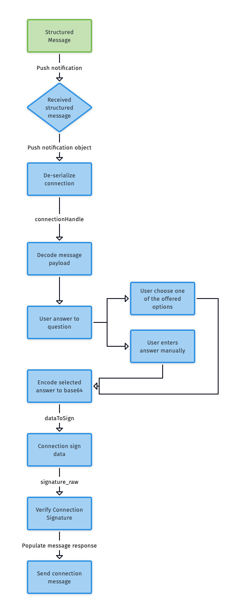

# Structured Messages (Questions)

Secured, encrypted communication between paired clients is established by following these steps:

- [1. Message received](#1-message-received)
- [2. Decoding message payload and deserializing connection](#2-decoding-message-payload-and-deserializing-connection)
- [3. Gathering the user answer](#3-gathering-user-answer)
- [4. Encoding the answer(s)](#4-encoding-the-answers)
- [5. Sending the encoded answer back to the server using method `connectionSendData`](#5-sending-the-encoded-answer-back-to-the-server-using-method-connectionsenddata)
- [6. Verifying the connection signature](#6-verifying-connection-signature)
- [7. Populating the answer object and sending the answer message back](#7-populate-answer-object-and-send-answer-message-back)
- [8. Sending the message](#8-sending-the-message)
- [Complete Flow: JavaScript Example](#complete-flow:-javascript-example)
  

<!-- Bonnie will create a new illustration-->

--- 

## 1. Message received
The message is received <!--[Q1] Which component receives this message: the mobile app? Did the server send the message?--> with predefined answers or with the response attribute name, so the user can choose from a list of predefined answers or enter the answer manually. 

<!--[Q2] Please provide the screenshot here. TODO: UI for presenting answers to user or form field(s) for answer manually needs to be added (it's not the part of the mobile SDK yet).-->


--- 
	
## 2. Decoding the message payload and deserializing the connection 

<!--[Q3] Provide a short description of how/why the [mobile app | server] decodes the message payload and deserializes the connection.-->

### iOS

<!--[Q4] Where is this code visible?-->

```ObjC

NSMutableDictionary *decryptedPayload = [NSJSONSerialization JSONObjectWithData: [msg[@"decryptedPayload"] dataUsingEncoding: NSUTF8StringEncoding] options: NSJSONReadingMutableContainers error: &error];

[[sdkAPI] connectionDeserialize: serializedConnection completion:^(NSError *error, NSInteger connectionHandle) {
	// handle errors
	NSMutableDictionary *decryptedPayloadMsg = [NSJSONSerialization JSONObjectWithData:[decryptedPayload[@"@msg"] dataUsingEncoding:NSUTF8StringEncoding] options:NSJSONReadingMutableContainers error:&error];
	
}
```

### Android

<!--[Q5] Where is this code visible?-->

```java
ConnectionApi.connectionDeserialize(serializedConnection)
    .exceptionally((t) -> {
        // hadle error response
        return -1;
    }).thenAccept(result -> {
        if (result != -1) {
            // handle successful response
        }
    });
```

---
	
## 3. Gathering the user answer 

After receiving message object, we need to ask user to select answer or enter it manually: <!--[Q6] What receives the message object? What asks the user to select?-->

In this example, the user selected the first object from and array of answers.

### iOS

<!--[Q7] Where is this code visible?-->

```ObjC
NSMutableDictionary *decryptedPayload = [NSJSONSerialization JSONObjectWithData: [msg[@"decryptedPayload"] dataUsingEncoding: NSUTF8StringEncoding] options:NSJSONReadingMutableContainers error:&error];
NSMutableDictionary *decryptedPayloadMsg = [NSJSONSerialization JSONObjectWithData: [decryptedPayload[@"@msg"] dataUsingEncoding: NSUTF8StringEncoding] options: NSJSONReadingMutableContainers error: &error];
NSString *data = decryptedPayloadMsg[@"valid_responses"][0][@"nonce"];
```
<!--[Q8] Where is the Android code?-->
---

## 4. Encoding the answer(s)

Before sending the answer to the Agency, it must be base64-encoded. 

### iOS

<!--[Q9] Where is this code visible?-->

```ObjC
NSData *plainData = [answerString dataUsingEncoding: NSUTF8StringEncoding];
NSString *encodedAnswer = [plainData base64EncodedStringWithOptions: 0];
```
<!--[Q10] Where is the Android code?-->
---

## 5. Sending the encoded answer back to the server using method `connectionSendData`

<!--[Q11] Provide a short description of how/why the mobile app (client?) sends the encoded answer (message?) back to the server.-->

### iOS

<!--[Q12] Where is this code visible?-->

```ObjC
[[sdkAPI] connectionSignData: (int)connectionHandle 
	withData: dataToSign
	withCompletion: ^(NSError *error, NSData *signature_raw, vcx_u32_t signature_len) {
	// handle errors
	NSData *dataToSign = [encodedAnswer dataUsingEncoding: NSUTF8StringEncoding];
}
```

### Android

<!--[Q13] Where is this code visible?-->

```java
ConnectionApi.connectionSignData(
	connectionHandle, 
	dataToSign, 
	dataToSign.length
).exceptionally((t) -> {
    
	return null;
}).thenAccept(result -> {
	try {
		if (result != null) {
			WritableMap signResponse = Arguments.createMap();
			signResponse.putString("data", new String(dataToSign));
			signResponse.putString("signature", Base64.encodeToString(result, base64EncodeOption));
			// handle successful result 
		} else {
			promise.reject("NULL-VALUE", "Null value was received as result from wrapper");
		}
	} catch(Exception e) {
		// You might get a value of a result that is not a byte array
		// or you might get an empty byte array.
		// In all those cases outer try...catch will not work because this is inside a callback of a Future
		// So you need to handle the case for a Future callback inside that callback
		promise.reject(e);
	}
});
```
<!--[Q14] In the commented text just above here I have made some edits: please verify. Also, the third line does not make sense: please rephrase.-->
--- 

## 6. Verifying the connection signature

<!--[Q15] Provide a short description of how/why the [mobile app | server] verifies the connection signature.-->

### iOS

<!--[Q16] Where is this code visible?-->

```ObjC
[[sdkAPI] connectionVerifySignature: (int)connectionHandle 		
	withData: dataToSign
	withSignatureData: signature_raw 
	withCompletion: ^(NSError *error, vcx_bool_t valid) {
	// handle errors
}
```

### Android

<!--[Q17] Where is this code visible?-->

```java
ConnectionApi.connectionVerifySignature(
	connectionHandle,
	dataToVerify,
	dataToVerify.length,
	signatureToVerify,
	signatureToVerify.length
).exceptionally((t) -> {
        // handle error result	        
		return null;
	}).thenAccept(result -> {
		// handle successful result	
	});
```

--- 

## 7. Populating the answer object and sending the answer message back

<!--[Q18] Provide a short description of how/why the [mobile app | server] populates the answer object and sends the answer message back.-->

### iOS

<!--[Q19] Where is this code visible?-->

```ObjC
NSString *signedData = [NSString stringWithUTF8String: [dataToSign bytes]];

NSDictionary *responseSig = @{
	@"signature" : signature,
	@"sig_data" : signedData,
	@"timestamp" : [timestamp string in seconds]
};
                                    
NSDictionary *messageToSign = @{
	@"@type" : @"did:sov:BzCbsNYhMrjHiqZDTUASHg;spec/committedanswer/1.0/answer",
	@"response.@sig" : responseSig
};

NSDictionary *messageOptions = @{
	@"msg_type" : @"Answer",
	@"msg_title" : @"Peer sent answer",
	@"ref_msg_id" : messageId
};
NSString *jsonString = [convert messageToSign to JsonString];
NSString *jsonMessageOptions = [Utilities messageOptions to JsonString];
```

### Android

<!--[Q20] Where is this code visible?-->

```java

```
<!--[Q21] Where is the Android code?-->

---

## 8. Sending the message 

<!--[Q22] Provide a short description of how/why the [mobile app | server] sends the message.-->

### iOS

<!--[Q23] Where is this code visible?-->

```ObjC
[[sdkAPI] connectionSendMessage:(int)connectionHandle withMessage:jsonString withSendMessageOptions:jsonMessageOptions withCompletion:^(NSError *error, NSString *msg_id) {
	// handle errors
}
```

### Android

<!--[Q24] Where is this code visible?-->

```java
ConnectionApi.connectionSendMessage(connectionHandle, message, sendMessageOptions)
	.exceptionally((t) -> {
    	// handle error result
			return null;
	}).thenAccept(result -> {
		// handle successful result
	});
```
 
---
## Complete Flow: JavaScript Example

This section shows the complete structured message flow in JavaScript.

1. Call `connectionSignData(connectionHandle, data, base64EncodingOption, encodeBeforeSigning )` 
<!--[Q25] Is there supposed to be a space before the closing parenthesis? Who/What does the call?-->

**Parameters**
<!--[Q26] Should this be a bullet list instead of a block of JavaScript?-->
```javascript 
	connectionHandle: 'from connection sending question'
	data: 'answer.nonce, would get this when you users selects answer from answers from your secureMessage'
	base64EncodingOption: 'defaults to 'NO_WRAP' in connect.me another option of "URL_SAFE"' 
	encodeBeforeSigning: 'defaults to true in connect.me'
```
    
**Returns**

```javascript    
	{ data, signature } //  to be used in connectionSendMessage
```


2. Call `connectionSendMessage(connectionHandle, withMessage)` <!--[Q27] Who/What does the call?-->

**Parameters**

```javascript
	connectionHandle: from connection sending question
	withMessage: JSON.stringify(
		'@type': 'did:sov:BzCbsNYhMrjHiqZDTUASHg;spec/committedanswer/1.0/answer',
	 	'response.@sig': {
		   	signature: signature, // signature from connectionSignData
		  	sig_data: data, // data from connectionSignData
		   	timestamp: moment().format(),
	  	}
	})

	endMessageOptions: JSON.stringify({
	    msg_type: 'Answer',
	  	msg_title: 'Peer Sent Answer',
	 	ref_msg_id: uid || null, // get uid from question.payload.uid (from secure message)
	})
```
<!--[Q28] Why is there a break here?-->

```javascript
	// JavaScript example
    async getMessages(pwDID) {
    
    }
```