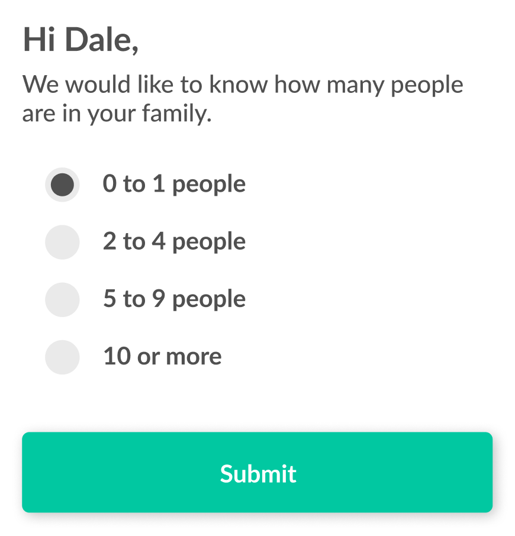

# Structured Messages (Questions)

Secured, encrypted communication between paired clients is established by following these steps:

- [Structured Messages (Questions)](#structured-messages-questions)
	- [Prerequisites:](#prerequisites)
	- [1. Message received](#1-message-received)
		- [iOS](#ios)
		- [Android](#android)
	- [2. Decoding the message payload and deserializing the connection](#2-decoding-the-message-payload-and-deserializing-the-connection)
		- [iOS](#ios-1)
		- [Android](#android-1)
	- [3. Gathering the user answer](#3-gathering-the-user-answer)
		- [iOS](#ios-2)
	- [4. Encoding the answer(s)](#4-encoding-the-answers)
		- [iOS](#ios-3)
	- [5. Sending the encoded answer back to the server using method `connectionSendData`](#5-sending-the-encoded-answer-back-to-the-server-using-method-connectionsenddata)
		- [iOS](#ios-4)
		- [Android](#android-2)
	- [6. Verifying the connection signature](#6-verifying-the-connection-signature)
		- [iOS](#ios-5)
		- [Android](#android-3)
	- [8. Sending the message](#8-sending-the-message)
		- [iOS](#ios-6)
		- [Android](#android-4)
	- [Final step](#final-step)
		- [iOS](#ios-7)
		- [Android](#android-5)

--- 

## Prerequisites: 

In order to provide your users best experience while using mobile app, we strongly suggests to implement and support push notifications. The steps for implementation of push notifications can be different for iOS and Android platform or you can use some of the solutions which offers support for both of them, like Google's [Firebase Cloud Messaging](https://firebase.google.com/docs/cloud-messaging). You will notice in our example code that we used the same. 

--- 

## 1. Message received
In this step, we assume you have installed push notification servise, so user does not need to manually download messages. Push notification message usally contains similar attributes like icon, vibrate, etc. but we are mostly interested in message body. 
Attributes in body we are looking for are: 

- **@type**: type for push notification message. It can be: *cred*, *credOffer*, *proofReq* and *Question*. For structured messages, type of the push notification will be **Question**.  
- **@uid**: identifier for specific message we are receiving
- **@forDID**: identifier for connection fom which notification was sent

When push notification message is received, we will need to call **downloadMessages** in VCX library, with providing uid and forDid details from notification body.  

All work regarding parsing and downloading messages we can ogranize in single class, we will call it `IndyMessages.<ext>` (extension depends on your preferred platorm, .swift / objc .h - .m, .java etc.)

### iOS

> IndyMessage.m
```ObjC
- (void)downloadMessages:
		(NSString *)messageStatus
        uid_s:(NSString *)uid_s
        pwdids:(NSString *)pwdids
        completion:(void (^)(NSError *error, NSString* messages))completion {

		}
```

### Android

> IndyMessage.java
```Java
public void downloadMessages(String messageStatus, String uid_s, String pwdids, Promise promise) {
	
}
```

As a result, we will have all details of question structure messsage with predefined answers or with the response attribute name, so the user can choose from a list of predefined answers or enter the answer manually. 

> Message body example: 
```json
"@type": "did:sov:BzCbsNYhMrjHiqZDTUASHg;spec/committedanswer/1.0/question",
    "@id": "[uid]",
    question_text: "Hi, Peter",
    question_detail:
      "Are you already connected to our platform?",
    valid_responses: [
      {
        "text": "Yes, I am",
        "nonce":
          "255c41413dcffcfaa4fe909cd65e477a5ed77d1550ba7f2c52cac58af84c4b8d"
      },
      {
        "text": "No, I am not",
        "nonce":
          "2a2a22bc64ecfda55fa40a2c9227c3592ac1399e63688b58d5f33c64b4326f77"
      }
    ],
    "@timing": {
      "expires_time": 3 // in minutes 
    }
```

--- 
	
## 2. Decoding the message payload and deserializing the connection 

Since message data with question and suggested answers are encoded (additionaly) in json string format, we need to decode it back to usable dictionary / object using steps in this section. After deserializing @msg['descryptedPayload'] attibute, we need to deserialize connection so we can get connection handle with which we can sign our response and return back to sender. 

### iOS

> IndyMessage.m
```ObjC
NSMutableDictionary *decryptedPayload = [NSJSONSerialization JSONObjectWithData: [msg[@"decryptedPayload"] dataUsingEncoding: NSUTF8StringEncoding] options: NSJSONReadingMutableContainers error: &error];

[[sdkAPI] connectionDeserialize: serializedConnection completion:^(NSError *error, NSInteger connectionHandle) {
	// handle errors
	NSMutableDictionary *decryptedPayloadMsg = [NSJSONSerialization JSONObjectWithData:[decryptedPayload[@"@msg"] dataUsingEncoding:NSUTF8StringEncoding] options:NSJSONReadingMutableContainers error:&error];
	
}
```

### Android

> IndyMessage.java
```java
ConnectionApi.connectionDeserialize(serializedConnection)
    .exceptionally((t) -> {
        // hadle error response
        return -1;
    }).thenAccept(result -> {
        if (result != -1) {
            // handle successful response
        }
    });
```

---
	
## 3. Gathering the user answer

After receiving message object and decoding to usable dictionary / object data in previous step, we need to ask user to select answer or enter it manually:



In this example, the user selected the first object from and array of answers.

### iOS

> IndyMessage.m
```ObjC
NSMutableDictionary *decryptedPayload = [NSJSONSerialization JSONObjectWithData: [msg[@"decryptedPayload"] dataUsingEncoding: NSUTF8StringEncoding] options:NSJSONReadingMutableContainers error:&error];
NSMutableDictionary *decryptedPayloadMsg = [NSJSONSerialization JSONObjectWithData: [decryptedPayload[@"@msg"] dataUsingEncoding: NSUTF8StringEncoding] options: NSJSONReadingMutableContainers error: &error];
NSString *data = decryptedPayloadMsg[@"valid_responses"][0][@"nonce"];
```
> IndyMessage.java
```java
	
```
---

## 4. Encoding the answer(s)

Before sending the answer to the Agency, it must be base64-encoded. 

### iOS

> IndyMessage.m
```ObjC
NSData *plainData = [answerString dataUsingEncoding: NSUTF8StringEncoding];
NSString *encodedAnswer = [plainData base64EncodedStringWithOptions: 0];
```
> IndyMessage.java
```java
	
```
---

## 5. Sending the encoded answer back to the server using method `connectionSendData`

In order to send user answer back to sender, we will need go through this flow, where some of the steps are already explained above: 

1. get serialized connection 
2. deserialize connection
3. encode user response to base64 format
4. sign connection data
5. verify connection signature
6. connection send message

For signing connection data, we will need to call VCX library method: `connectionSignData`:

### iOS

> IndyMessage.m
```ObjC
[[sdkAPI] connectionSignData: (int)connectionHandle 
	withData: dataToSign
	withCompletion: ^(NSError *error, NSData *signature_raw, vcx_u32_t signature_len) {
	// handle errors
	NSData *dataToSign = [encodedAnswer dataUsingEncoding: NSUTF8StringEncoding];
}
```

### Android

> IndyMessage.java
```java
ConnectionApi.connectionSignData(
	connectionHandle, 
	dataToSign, 
	dataToSign.length
).exceptionally((t) -> {
    
	return null;
}).thenAccept(result -> {
	try {
		if (result != null) {
			WritableMap signResponse = Arguments.createMap();
			signResponse.putString("data", new String(dataToSign));
			signResponse.putString("signature", Base64.encodeToString(result, base64EncodeOption));
			// handle successful result 
		} else {
			promise.reject("NULL-VALUE", "Null value was received as result from wrapper");
		}
	} catch(Exception e) {
		promise.reject(e);
	}
});
```
--- 

## 6. Verifying the connection signature

Signature verification is also happening in VCX library by calling: `connectionVerifySignature`. It's important step to link answer data with question signature received from previous step `connectionSignData`.

### iOS

> IndyMessage.m
```ObjC
[[sdkAPI] connectionVerifySignature: (int)connectionHandle 		
	withData: dataToSign
	withSignatureData: signature_raw 
	withCompletion: ^(NSError *error, vcx_bool_t valid) {
	// handle errors
}
```

### Android

> IndyMessage.java
```java
ConnectionApi.connectionVerifySignature(
	connectionHandle,
	dataToVerify,
	dataToVerify.length,
	signatureToVerify,
	signatureToVerify.length
).exceptionally((t) -> {
        // handle error result	        
		return null;
	}).thenAccept(result -> {
		// handle successful result	
	});
```
--- 

## 8. Sending the message 

After successful verifcation, we finally can bundle our response and send it back using `connectionSendMessage` method in VCX.

### iOS

> IndyMessage.m
```ObjC

 NSTimeInterval timeInSeconds = ([[NSDate date] timeIntervalSince1970] * 1000);
	NSString *intervalString = [NSString stringWithFormat:@"%f", timeInSeconds];
    NSDictionary *responseSig = @{
		@"signature" : signature,
        @"sig_data" : signedData,
		@"timestamp" : intervalString
	};
    
	NSDictionary *messageToSign = @{
		@"@type" : @"did:sov:BzCbsNYhMrjHiqZDTUASHg;spec/committedanswer/1.0/answer",
		@"response.@sig" : responseSig
	};
                                    
	NSDictionary *messageOptions = @{
		@"msg_type" : @"Answer",
		@"msg_title" : @"Peer sent answer",
		@"ref_msg_id" : messageId
	};
	
	NSString *jsonString = [Utilities toJsonString:messageToSign];
	NSString *jsonMessageOptions = [Utilities toJsonString:messageOptions];
	
	[appDelegate.sdkApi connectionSendMessage:(int)connectionHandle withMessage:jsonString withSendMessageOptions:jsonMessageOptions withCompletion:^(NSError *error, NSString *msg_id) {
		NSLog(@"Replied to message : %@", messageId);
	}];
[[sdkAPI] connectionSendMessage: (int)connectionHandle
	withMessage:jsonString
	withSendMessageOptions: jsonMessageOptions
	withCompletion: ^(NSError *error, NSString *msg_id) {
	// handle errors
}
```

### Android

> IndyMessage.java
```java
ConnectionApi.connectionSendMessage(connectionHandle, message, sendMessageOptions)
	.exceptionally((t) -> {
    	// handle error result
			return null;
	}).thenAccept(result -> {
		// handle successful result
	});
```
 
## Final step 

At the end of the flow, we should call download again all messages from same connection in order to see our lastest message signed properly: 

### iOS

> IndyMessage.m
```ObjC
- (void)downloadMessages:
		(NSString *)messageStatus
        uid_s:(NSString *)uid_s
        pwdids:(NSString *)pwdids
        completion:(void (^)(NSError *error, NSString* messages))completion {

		}
```

### Android

> IndyMessage.m
```Java
public void downloadMessages(String messageStatus, String uid_s, String pwdids, Promise promise) {
	
}

