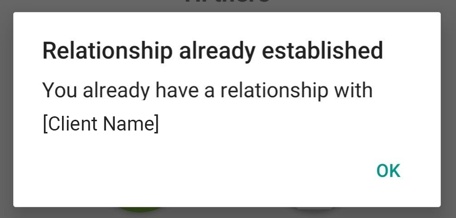

# Connection Redirection

With adding more and more connections, its getting hard for user to remember which connections are already established. There is potential that some of the new connections user tries to establish already exists in list of connections. Verity Server (backend service cloud agent) can't accept new connection if previous connection with same client already exists. 

In that case, instead of creating new, duplicated connection, server will reject new connection with new status, `VcxStateRedirected` and redirect to previously established connection with some app client. 

New methods in SDK VCX are: 
- vcx_connection_redirect 
- vcx_connection_get_redirect_details

This methods should be implemented on server side in your custom implementation of Verity server. 

Redirect details returns object with this details:

```javascript
{
  DID: my pairwise did,
  verKey: my pairwise verkey,
  publicDID: my public did (optional)
  theirDID: pairwise did of other party
  theirVerKey: pairwise verkey of other party
  theirPublicDID: public did of other party (optional)
}
```

## Connection redirection flow - Cloud Agent

Full user flow between mobile app and cloud agent server should look like this: 


> Roles: Alice with Connect.Me, Acme corp’s website
> Case: Returning user, both have valid connection


1. Alice comes to Acme’s website and shows intent for using a product/service.
2. Acme displays QR code with connection invite.
3. Alice scans QR code and finds out that she already has a connection with Acme in the wallet, so she initiates redirection.

> nodejs wrapper
```
const oldConnectionToAcme = searchConnectionsByPublicDID({
  public_did: inviteDetails.publicDID
})
const redirectConnectionToAcme = await Connection.createWithInvite({
  id: 'faber-redirect',
  invite: JSON.stringify(inviteDetails)
})
await redirectConnectionToAcme.redirect({
  redirectToConnection: oldConnectionToAcme
})
```

4. Acme periodically checks for state of connection and receives redirected state. Then 
5. Acme finds the old connection using provided redirect details.

```javascript
await connectionToAlice.updateState()
connectionState = await connectionToAlice.getState()

if (connectionState == StateType.Redirected) {
  redirectDetails = await connectionToAlice.getRedirectDetails()
  serializedOldConnection = searchConnectionsByTheirDid({
    theirDid: redirectDetails.theirDID
  })
  oldConnection = await Connection.deserialize({
    connectionData: serializedOldConnection
  })
  // use oldConnection for the communication, eg. request proof
}
```
Acme continues communication with Alice using the old connection.


Here is an example of two connections which one of them is existing one: 

```javascript
let vcx = require('node-vcx-wrapper');
let ffi = require('ffi');
let fs = require('fs');
const {Schema, CredentialDef, Connection, IssuerCredential, Proof, StateType, Error, rustAPI} = vcx;
function sleep(ms) {
  return new Promise((resolve) => setTimeout(resolve, ms));
}
async function run() {
    const myffi = ffi.Library('/usr/lib/libnullpay.so', { nullpay_init: ['void', []] });
    await myffi.nullpay_init();
    await vcx.initVcx("vcxconfig.json");
    const connection1 = await Connection.create({id: 'Connection 1'});
    await connection1.connect({data:'{"use_public_did": true}'});
    await connection1.updateState();
    let details = await connection1.inviteDetails(true);
    console.log("*** Create QR code out of this invite externally and scan it with ConnectMe app ***\n");
    console.log(details);
    let connection_state = await connection1.getState();
    while (connection_state !== StateType.Accepted) {
        await sleep(2000);
        await connection1.updateState();
        connection_state = await connection1.getState();
	//console.log(connection_state);
    }
    console.log('Connection 1 was accepted!');
    console.log('Connection 1 details: ');
    console.log(JSON.stringify(await connection1.serialize(),null,4));
    const connection2 = await Connection.create({id: 'Connection 2'});
    await connection2.connect({data:'{"use_public_did": true}'});
    await connection2.updateState();
    details = await connection2.inviteDetails(true);
    console.log("*** Create QR code out of this invite externally and scan it with ConnectMe app ***\n");
    console.log(details);
    connection_state = await connection2.getState();
    while (connection_state !== StateType.Redirected) {
        await sleep(2000);
        await connection2.updateState();
        connection_state = await connection2.getState();
        //console.log(connection_state);
    }
    console.log('Connection 2 was redirected!');
    console.log('Connection 2 details: ');
    console.log(JSON.stringify(await connection2.serialize(),null,4));
    console.log('Redirect details: ');
    console.log(await connection2.getRedirectDetails());
}
run();
```

## Connection redirection - mobile app client (ConnectMe or MobileSDK app)

Important steps needed to be communicated with user who tries to establish connection are: 

- clearly indicate that current connection can not be established
- communicate that there is already establish connection in user stack with same cloud agent
- redirect or present modally details from existing connection.


### **Implementation** should look like this: 

1. Alice comes to Acme’s website and shows intent for using a product/service.
2. Acme displays QR code with connection invite.
3. Alice scans QR code and send new request for establishing connection. 
4. If response object contains status of `VcxStateRedirected`, use attribute `publicDID` to identify which of the existing is the same as connection Alice want to connect to and navigate her (or present modally) details of that connection. 



Note: It will be even faster and better for UX if you can recognize existing connection even before sending request for establishing it and redirect user immediately to it.

Example in code: 

> In QRCode scan controller: 
```javascript

  checkExistingConnectionAndRedirect = (invitation: {
    payload: InvitationPayload,
  }) => {
    const { navigation } = this.props
    // check if we got public DID in invitation
    // if we have public DID, then check if connection already exist
    // if connection exist, then redirect to connection history
    // otherwise redirect to invitation screen
    const { publicDID = '' } = invitation.payload.senderDetail
    const connectionAlreadyExist = publicDID in this.props.publicDIDs

    if (connectionAlreadyExist) {
      const {
        senderDID,
        senderName,
        identifier,
        logoUrl: image,
      } = this.props.publicDIDs[publicDID]
      const params = {
        ...
        qrCodeInvitationPayload: invitation.payload,
        ...
      }
      // navigate to previously established connection details

      return
    }
    
    // not established connection, proceed with regular invitation flow 
  }

```

