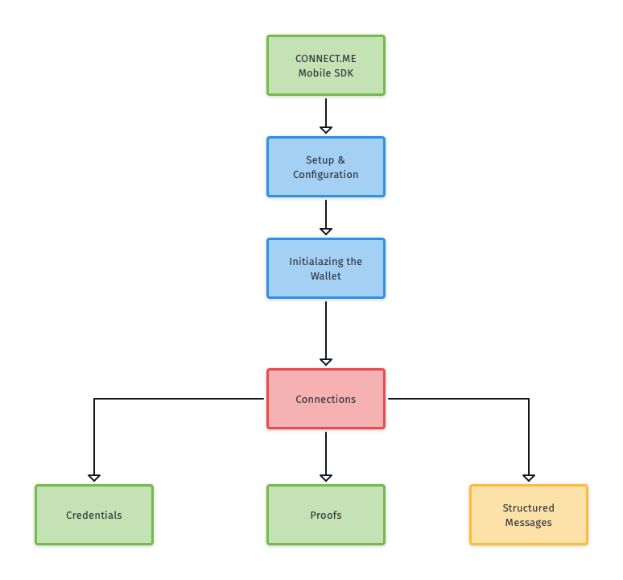

**Notice: On October 20, 2020, all new installations of a mobile application built with Evernym’s Mobile SDK will require an access token to provision with Evernym’s cloud services. Without the access token, new app installations will fail to provision with the Consumer Agency Service and will be rejected with an unauthorized access error.**

# Mobile SDK

## Introduction
The tools in this repository will help you to build mobile identity agents to hold verifiable credentials in a self sovereign identity ecosystem. These identity agents will be compatible with standards such as:
* [Trust Over IP](https://trustoverip.org/)
* [Hyperledger Aries](https://www.hyperledger.org/use/aries)
* [DIDComm](https://identity.foundation/working-groups/did-comm.html)
* [W3C Verifiable Credentials](https://www.w3.org/2017/vc/WG/) (UNDER DEVELOPMENT)
* [W3C Decentralized Identifiers](https://w3c.github.io/did-core/) (UNDER DEVELOPMENT)

These tools depend on the Evernym Consumer Agency SaaS service to act as a communication mediator in the cloud which provides a persistent address for communication and herd anonymity. Access to the Consumer Agency is provided to Evernym customers (see the section "[Getting Help](#getting-help)").

## Getting Help
This SDK is currently in "Beta" status.

Evernym provides commercial support to customers. If you would like help from Evernym, please [contact us](https://www.evernym.com/our-team/#contact).

## Getting Started
Connecting and exchanging encrypted data between an Agency (server side) and an Edge Client (mobile application) consists of several steps and is supported by a secured, encrypted protocol library (VCX). 

Going through this tutorial we will create a simple application which will allow us to accept and present verifiable encrypted credentials.

Before starting, please read the [Base Concepts document](docs/0.Base Concepts.md) containing explanations for terms that will be frequently used in this guide.

1. [Create a new App](docs/1.ProjectSetup.md)
1. [Initialize Wallet and Agent](docs/2.Initialization.md) on a specific Agency (web server)
2. [Establish a connection](docs/3.Connections.md) with an another user  
3. [Accept offered credential](docs/4.Credentials.md)
4. [Respond to a proof request](docs/5.Proofs.md)
5. [Exchange secured structured messages](docs/6.StructuredMessages.md)
7. [Connection Redirection](docs/7.ConnectionRedirection.md)

#### Additional Sources:
* [Configuration](docs/Configuration.md) &#8212; The list of all VCX library configuration options. 
* [Errors](docs/vcx/VcxErrors.md) &#8212; The list of all possible VCX errors and their definitions. 
* [New Messages Processing](docs/vcx/Messages.md)
* [Credentials With Attachments](docs/9.CredentialsWithAttachments.md)
* [Push Notifications](docs/PushNotifications.md)
* [Frequently asked questions](docs/FAQ.md)

### Helpful links
- Connect.Me Public Beta &#8212; Most of the features of the Evernym Mobile SDK are showcased in [Connect.Me](https://connect.me/). You can use upcoming releases of Connect.Me by clicking the appropriate link from your device.
  - IOS: [https://testflight.apple.com/join/bmbX21Kq](https://testflight.apple.com/join/bmbX21Kq)
  - Android: [https://play.google.com/apps/testing/me.connect](https://play.google.com/apps/testing/me.connect)
- <a href="https://github.com/sovrin-foundation/connector-app" target="_blank">Sovrin Connector App</a> &#8212; Helpful resource to see how an older version of mobile SDK works.
