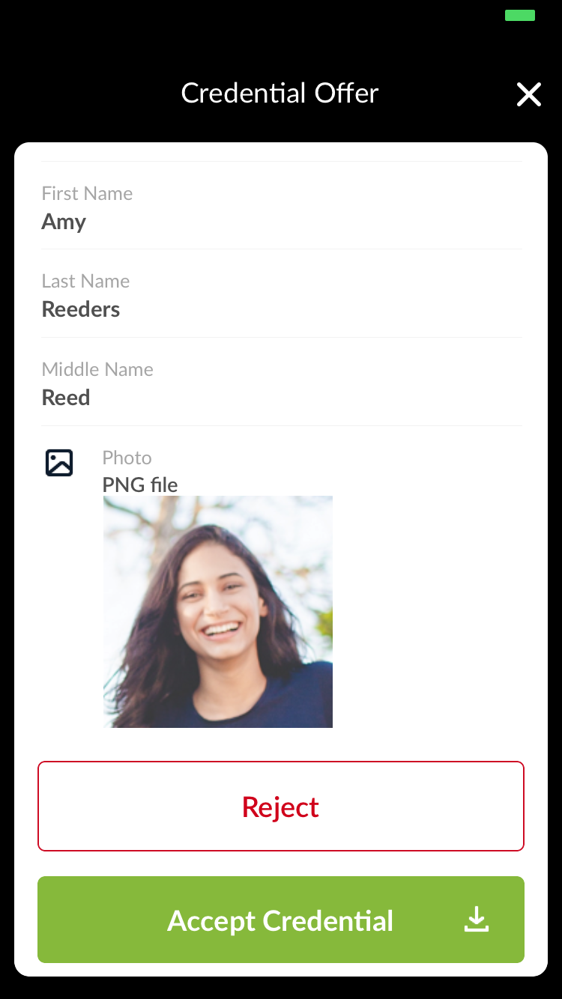
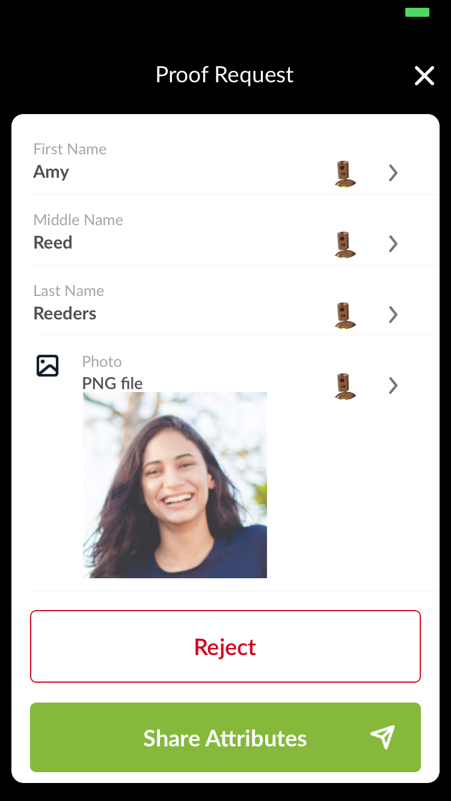

# ConnectMe - Attachments usage

General:

* Attachments should be added in form of base64 encoded string.
* Photo, audio, video and other common documents can be attached to a credential and supported in client application.
* Field name must have `_link` postfix to be treated as an attachment by the application.
* All supported types are listed in [Supported mime types](#supported-mime-types) section.

## Issuing credentials with attachments

Let's assume that we are going to issue a credential with attached photo.

To use attachment field in credential the next JSON string will be used as value in credential attributes list:

```json
{
  "mime-type": "image/png",
  "extension": "png",
  "name": "my_photo.png",
  "data": {
    "base64": "BASE_64_ENCODED_STRING"
  }
}
```

`mime-type`, `extension` and `name` should be filled with file name, its extension and mime type.
Please refer to [Supported mime types](#supported-mime-types) section to find out which mime types are currently supported in Connect.Me application.

`data` field should contain JSON object which has `base64` field.
Attached file should be encoded as base64 string and this string should be used and `base64` field's value.

Also to mark field as an attachment, `_link` postfix must be added to credential field name.

So credential attributes in `credential_attrs` field should look like this

```json
{
  "First Name": "Amy",
  "Last Name": "Reeders",
  "Photo_link": "{\"mime-type\": \"image/png\", \"extenstion\": \"png\", \"name\": \"my_photo.png\", \"data\": {\"base64\":\"data:image/png;base64....\"}}"
}
```

### Create credential offer on agency side

For example, to create a credential offer with VCX python wrapper we need to list these attributes and create `IssuerCredential` object:

```python
cred_attrs = {
  "First Name": "Amy",
  "Last Name": "Reeders",
  "Photo_link": "{\"mime-type\": \"image/png\", \"extenstion\": \"png\", \"name\": \"my_photo.png\", \"data\": {\"base64\":\"data:image/png;base64....\"}}"
}

cred = await IssuerCredential.create('cred_uuid', cred_attrs, cred_def.handle, 'alice_credential', '0')

```

## Requesting field with attachment in proof request

To request a credential with an attachment, field name with `_link` postfix should be used in proof request attributes.
So requested attributes will look like this

```json
"requested_attributes": {
  "First Name": {
    "name": "First Name"
  },
  "Last Name": {
    "name": "Last Name"
  },
  "Photo": {
    "name": "Photo_link"
  },
}
```

### Create proof request on agency side

For example, to generate a proof request with VCX python wrapper, we need to list these fields in `proof_attrs` and create `Proof` object:

```python
proof_attrs = [
  {"name": "First Name", "restrictions": []},
  {"name": "Photo_link", "restrictions": []},
]

proof = await Proof.create('proof_uuid', 'proof_from_alice', proof_attrs, {})
```

## Displaying attributes with attachments

When Connect.Me application gets attribute with `_link` postfix, it tries to render credential field as field with attachment according to defined mime type.

### Examples

#### Credential

```json
{
  "First Name": "Amy",
  "Middle Name": "Reed",
  "Last Name": "Reeders",
  "Photo_link": "{\"mime-type\": \"image/png\", \"extenstion\": \"png\", \"name\": \"my_photo.png\", \"data\": {\"base64\":\"data:image/png;base64....\"}}"
}  
```



#### Proof request

```json
{
  "requested_attributes": {
    "First Name": {
      "name": "First Name"
    },
    "Middle Name": {
      "name": "Middle Name"
    },
    "Last Name": {
      "name": "Last Name"
    },
    "Photo": {
      "name": "Photo_link"
    },
  }
}
```



## Supported mime types

* Photo types:
  * `image/jpeg`
  * `image/png`
  * `image/jpg`
* MS Word types:
  * `application/msword`
* MS Excel types:
  * `application/vnd.ms-excel`
* MS Powerpoint types:
  * `application/vnd.ms-powerpoint`  
* PDF types:
  * `application/pdf`
* Audio and video types:
  * `audio/mp4`
  * `audio/mpeg`
  * `audio/mp3`
  * `video/mp4`
