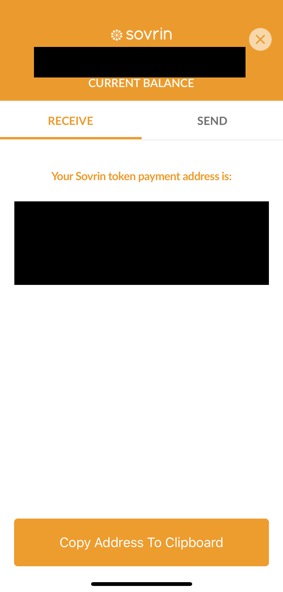

## E2E tests, One time setup

* Node >= 8.5.0, XCode = 10.0 || 10.1 || 10.2
* `$ brew update`
* `$ brew tap wix/brew && brew install applesimutils`
* `$ brew install imagemagick && brew install GraphicsMagick`
* `$ yarn global add detox-cli`

## Running e2e tests

* `$ yarn e2e`

  That's it.

  Above command will check that if there is already a debug build present or not. If no debug build is already generated, then it will generate a debug build. Once e2e finds debug build, then it chooses `iPhone XS Max` as default simulator, uninstalls any previous app install of ConnectMe, installs debug build, and use QA Test 1 as default environment and setup pass code to 000000, and starts running all tests which are under `__tests__` directory.

* We can customize above command for different environment, simulator, build type, specific tests to run etc. [See all available e2e CLI options here](#running-tests)

#### Possible issues while setting up environment for e2e tests

> If we get an error for installing imagemagick about `/usr/local/Frameworks`, then run below commands and run `$ brew install imagemagick` again
```sh
sudo mkdir /usr/local/Frameworks
sudo chown $USER /usr/local/Frameworks
```

> If we get an error about permission for ruby gems then run this command `sudo chown -R $(whoami) /usr/local/lib/ruby/gems/2.4.0/gems/`

> If we get below error while trying to install `applesimutils`
```
applesimutils: /usr/local/Homebrew/Library/Taps/wix/homebrew-brew/applesimutils.rb:4: syntax error, unexpected <<, expecting end
<<<<<<< HEAD
^~
/usr/local/Homebrew/Library/Taps/wix/homebrew-brew/applesimutils.rb:18: syntax error, unexpected ===, expecting end
=======
```

Run below commands to fix this issue
```sh
$ cd $(brew --repo)
$ cd Library/Taps/wix/homebrew-brew
$ git reset --hard HEAD
$ brew install applesimutils
```

> If we get an error in logs saying that `image not found`. Run `$ detox clean-framework-cache && detox build-framework-cache`, then run last command in above steps

#### Possible issues while running e2e tests

> If we get an error while trying to type pass code. Ensure that all simulators has hardware keyboard disconnected. `Hardware -> Keyboard -> Un check 'Connect Hardware Keyboard'`

> If we don't get any error, but when tests start running, tests can't find simulator or `device is undefined`. This generally means that either simulator is not started or `applesimutils` is not able to find simulators. Run `applesimutils --list` and see if this command returns the name of simulator that you have already running. If `applesimutils --list` does not show the simulator on which you want to run tests, then uninstall applesimutils and reinstall it.

```sh
brew uninstall applesimutils
brew install applesimutils
```

> If tests still does not find simulator/device, then make sure that simulator is running before running tests. Run command `$ xcrun simctl boot "iPhone 7"` to launch simulator

> If our tests start running and installs the app on simulator/device and then app does not proceed further and hangs/crash. Then try to run `$ detox clean-framework-cache && detox build-framework-cache`. Also, go to node_modules/detox/ios and unzip the source files and try to run tests again.

#### Running simulators

* `$ xcrun simctl boot "iPhone 7"` - this command can launch a simulator directly
* If the xcrun command does not launch the iOS simulator then launch it from XCode. From menu `XCode -> Open Developer tool -> Simulators`

## Running tests

Tests can be run by `yarn e2e`. There are few options to customize while running tests.

| Option | Default | Description |
| --- | --- | --- |
| -b, --build | - | build connectme first, and then run tests. By default e2e script checks that if we already have a build in `build` folder, if build does not exist, then it runs debug build first and then run tests. However, we can pass this option to generate new build. We might need this option if we want to test release build or if we have made some native changes or included new libVcx build, then we would have to build again and then run tests, so in those cases we can use this option |
| -s, --simulators | iphonexsmax | specify on which simulator tests should run. We can specify multiple values with this option. If we specify more than one simulator, then it would run tests on all those passed simulator in parallel. Possible values that we can pass are `iphone5s iphone7 iphone8 iphonex iphonexsmax`. The way we can pass multiple value on command line `-s iphone5s iphone7` |
| -u, --update | false | whether to update failing screenshots with new ones |
| -t, --testToRun | all tests under \__tests__ | we can pass specific test file which we need to run. For example: if we just need to run token tests, then we can run `yarn e2e -t token`. Do not add `.spec.js` to the test file name that we need to run. If we have to run tests only from  connection.spec.js, then command would be `yarn e2e -t connection`|
| -e, --environment | QA Test 1 | select environment which should be used to run end-to-end tests. Possible options are `dev, sandbox, staging, prod, demo, qatest1, qa, devteam1, devteam2, devteam3, devrc` |
| -k, --skip | false | do not re-install app even if it is a new session. Developer should be sure that by passing this flag we are not going to uninstall previous app installation and run tests on previous installed app. This flag if used wisely can give more than 30 seconds of boost in running e2e tests per simulator. Since this flag does not install new app, developer should be aware that no new build change has be done from last time the app was installed on simulator. This is especially useful if we are running e2e tests continuously on dev machine or we need to run only single test file every time or we are changing JS code of react native and need to keep testing stuff in e2e tests.  |
| -- | - | Once we pass this option then we can pass any option which we can pass to `detox` directly. See [this documentation](https://github.com/wix/Detox/blob/master/docs/APIRef.DetoxCLI.md#test) to check what options we can pass to detox  |
| --help | | show usage and available commands on terminal |

### Few Examples

- Force a new build and run on iphone5s simulator
    ```sh
    $ yarn e2e -b debug -s iphone5s
    or
    $ yarn e2e --build debug --simulators iphone5s
    ```
- Run on multiple simulators
    ```sh
    $ yarn e2e -s iphone7 iphonex iphonexsmax
    ```
- Pass detox options as well along with our e2e options
    ```sh
    $ yarn -- e2e -b debug -u -s iphone7 -- -r

    # Pay attention to two `--`, one at beginning, second before passing any detox specific option (-r)
    # Why do we need --, yarn is warning that we don't need --. Check architectural decisions section for more info on this.

    # Short answer is, if we don't need to pass detox options, then we don't need --.
    ```
- Run only token tests on staging environment and reuse installed app
    ```sh
    $ yarn e2e -- -t token -e staging -- -r
    ```

### Frequently asked questions

- How can we run tests on iPhone 5s, iPhone 7 & iPhone X in parallel?

  Start one terminal and run
    ```sh
    $ yarn e2e -s iphone5s
    ```

  Start another terminal and run

    ```sh
    $ yarn e2e -s iphone7
    ```

  Start another terminal and run
    ```sh
    $ yarn e2e -s iphonex
    ```
  All of the simulators will be running all tests in parallel. This is not test parallelization which we talk at the end of this document in [this section](#optimizations-yet-to-do)
- How can I record video of test running in simulator?
    ```sh
    $ yarn e2e -- -- --record-videos all

    # Yes, we need to pass two `--`. Refer architecture decision question about --
    ```
- How can I record video of only failing test?
    ```sh
    $ yarn e2e -- -- --record-videos failing
    ```
- What does normal development command looks like?
    ```sh
    $ yarn e2e -t token -k -s iphone5s iphone7 iphonex iphonexsmax
    ```

## E2E test runner architectural decisions

- *Tests are run by default with debug build and on simulator:* Since, we want much faster feedback loop while developing, it is not desirable to always have a device, or keep running release build. Generating release build itself take 2-3 minutes, and then we would have to uninstall and reinstall build, then change environment and make connection etc. It would take just too much in development process to run these tests and developers will not running e2e tests due to time taken to run them even once. We want to optimize development experience and hence decisions which runs things default are optimized for development process. Also, when build is generated in debug mode, then JavaScript bundle is loaded from packager server, so if we change our react native code, we won't have to re-build and our test run will pick up new changes automatically. We can still run tests in release mode, we would have to pass option in command running e2e test. Refer [Running Tests](#running-tests) sections for more details around it.
- Why our own cli on top of detox?

  Let us try to answer why we created our own cli to run detox tests even though detox has a pretty good cli. Below are the reasons why we did it:
  - Main reason why we had to do it, is our UI/screenshot based testing. Since we take screenshot of screen inside simulator and then compare those screenshots, we need to know which simulator we are running on. Once we know which simulator we are running on, we can crop some part of image, know dimensions of screenshot and perform few other operation on image. And the way we know which simulator we are running is by setting an environment variable such as `simulator=iphone7`, if we hadn't created our own cli, then every time we run `detox test`, we had to run `cross-env simulator=iphone7 detox test`. If we think that we can just put it package.json scripts and run that script, then package.json scripts will keep on increasing for every simulator and for every env variable, so growth would `m X n` and is not a manageable/maintainable solution. Check [screenshot tests](#screenshot-tests) section for in-depth details.
  - We need to update our screenshots as well. So, for that as well we had to write similar `cross-env update=yes detox test`
  - Even though detox has nice cli, but detox does not nice way to manage defaults. If we have to run iphone7 simulator by default, then we can't do it with detox. To run it with detox we had to do `detox test -c ios.sim7.debug`
  - If we have to run tests on multiple simulator simultaneously then we have to run detox command manually in separate terminal by providing separate config. But our cli can handle it just fine
  - There is no way to parallelize test runs on multiple simulator with detox cli. But our cli can potentially parallelize tests and hence cut overall test time to under 3 minutes.
- Why was option --skip shortened to -k and not -s?

  -s was already taken by simulators option. -r for reuse was taken by detox, -n to signify -no-install was taken by detox for --name, -u for uninstall was taken by --update of our cli. So why not -sk, because command line shortened arguments should be single letter. So, randomly picked -k, second letter of --skip

- Why do we need *initial.spec.js*?

  We are using this file to run initial setup of tests. Since detox launches app inside simulator for every test file, that means inside every test we would need to keep checking whether lock was setup or not, if it is not setup, then setup lock and if yes, then determine lock type and then unlock.

  Obviously, all of this functionality can be made into a function, but there is another reason why we need to have this file. Detox, by default uninstalls the app to run tests from every file so if there are 10 test files, then detox would install, uninstall app inside simulator 10 times. That would increase 20 seconds in every test, which is not good at all, since we don't want to keep testing lock/unlock functionality when we could spend that time in testing other stuff.

  Detox solved this problem (install/uninstall every time) recently, and gave an option to use --reuse which would not uninstall the app, but just launch the app again. However, detox did not come up with full solution. If we launch our tests with --reuse option, then app would not be launched if simulator already does not have detox build installed on it. That means to use --reuse option of detox cli, we need to manually install the build first on simulator and then run detox test. There is no command provided by detox or other simulator utils which can tell us if app is already installed or not. So, we don't know if we need to install the app. Also, there is no simple install command to install app, detox does not expose any command to us to install the app. Even if it did, we can't be sure that existing installation of app on the simulator belongs to the current test run. It could be an old build.

  So, we need to be sure of just one installation only for this test session. All of the above reasons comes to the point where we need to do below
  - Delete previous installed app
  - run app setup only once, where we set environment, choose lock, and go to home
  - start running all other tests, by not uninstalling app and saving time

- Why are we passing `--` when yarn is warning us that starting yarn 1.0, we don't need to pass `--`?

  We totally agree that this is not how it should be. But Unfortunately we need first `--`. The warning which yarn is specifying is correct, that is how we need to pass options to our script without `--`. But, the problem for us is that apart from passing options to our own cli, we need to pass options to detox cli as well. So, our cli will take it's own options, and then our cli needs to know which options are meant for detox cli. So, if we don't add first `--`, then yarn does not tell our cli which options are for detox. For example:

  ```
  $ yarn e2e -b debug -- --reuse
  ```
  In above script we are telling yarn that we want to pass --reuse to detox, but other params for our own cli. But the way our CLI receives params from yarn is --reuse is also considered as a param for our cli. So, to make yarn behave in a way that after --, we know options are pass through, we need to bypass yarn by passing -- at first place. So, that's why we need to pass `--` two times if we need to pass options to detox.

  However, if we don't need to pass options to detox, then we can totally skip any `--`, and just pass options.

  We agree that this is not how it should be, but this is how yarn is behaving and we needed a workaround for passing options directly to detox.

## Screenshot tests

### Background
While testing an application there are libraries and tools that we can use to test functionality. For example, in mobile application we can test whether user can click on a button and navigate to a screen. However, how do we test if that button is at the proper place in UI, or whole layout of home screen is unchanged by some style refactoring or opacity of button is same as it was last time. These all things belong to UI testing and remain in realm of manual testing.

The way we are going to test UI and layout is similar to [Jest snapshot](https://facebook.github.io/jest/docs/en/snapshot-testing.html), but instead of serializing view in json format, we will save the screenshot of a screen in image, and instead of comparing a JSON object, we will be comparing an image with another image.

### Approach

When we run tests for the very first time, we will take a screenshot of the screen and save it. A screenshot can be taken in any test by

```js
import { matchScreenshot } from './screenshot'
...
describe('App', () => {
  it('home screen', async () => {
    // this takes care of all screenshot related stuff
    await matchScreenshot('home.jpg')
  })
})
```
Let's dive into details of what happen inside `matchScreenshot`.

We first decide that which simulator is running the test. If iPhone X is running the test, then all default screenshots will go to `iphonex` directories. The way we know which simulator is running test is via our own mini cli `e2e-cli`. It sets an environment variable before running tests and we get the value of environment variable to identify simulator.

Once we know the simulator, then we need to know whether this is the first time we are taking a screenshot with the name passed in `matchScreenshot`. If this is the first time we are taking screenshot, then this screenshot directly goes to `e2e/screenshots/screenshots/iphonex/` directory. If this is not the first time we are taking screenshot, that means we have something to compare to, then we put the screenshot to `e2e/screenshots/tmp/iphonex/` directory. Whatever the UI design that we have at very first run of tests will be considered as base UI.

Now, we compare existing and new screenshots and check if UI is changed or not. If UI is changed, then we print the error on console, fail test, generate an image which highlights the differences with red color and save diff image in `e2e/screenshots/diff/iphonex/` directory. If changes are regression and we don't want them, we go ahead and fix the code till tests pass.

If we want to keep new changes and override the existing ones, then we run test via commands that has `-u/--update` flag (`yarn e2e -u`). Apart from setting SIMULATOR environment variable, we are setting UPDATE environment variable as well. This environment variable helps us to decide whether we need to remove existing screenshots and override with new ones.

### How to handle dynamic areas of screen

When are perform screenshot testing we quickly run into an issue that even though UI is correct and has not changed from previously good known UI, but screenshot comparison still fails due to dynamic data being populated on UI. A good example is date field, if we have date field showing up anywhere in UI, it will be different most of the time. So, when we perform screenshot diffing, date will be caught up in diff, and hence diff will fail. So, what do we do, if we need to selective ignore an area which has dynamic data and we don't care about UI testing of that area, and we would perform other testing on that area inside our test.

For purpose of dynamic area ignorance, we are using below mechanism.

1. Get to know `top, left, width, and height` of dynamic element in react native/simulator/device. Add `ref`, `onLayout` prop to the element which is rendering dynamic element.

    ```js
      // add ref and onLayout prop
      <DynamicAddress
        ref={address => this.element = address}
        onLayout={this.onLayout}
      />

      // define ref on class as property
      element = null

      // handle onLayout, and get top, left, width and height
      onLayout = () => {
        setTimeout(() => {
          this.element.measure((fx, fy, width, height, left, top) => {
            alert(
              `w: ${width}, h: ${height}, x: ${left}, y: ${top}`
            )
          })
        }, 2000)
      }
    ```

2. Above process needs to be done once per simulator. Once we know what is the area that we need to ignore. We create an object with below format.
    ```js
    const walletAddressArea = {
      iphone5s: {
        top: 272,
        left: 19,
        width: 282,
        height: 131,
      },
      iphone7: {
        top: 272,
        left: 19,
        width: 337,
        height: 106,
      },
      iphone8: {
        top: 272,
        left: 19,
        width: 337,
        height: 106,
      },
      iphonex: {
        top: 296,
        left: 19,
        width: 337,
        height: 82,
      },
      iphonexsmax: {
        top: 296,
        left: 19,
        width: 337,
        height: 82,
      },
    }
    ```
3. Above is done for one area to be ignored, we can ignore multiple areas on an image if we want to, we just need above format for each area. Pass ignore area object to `matchScreenshot`
    ```js
    await matchScreenshot('token-dashboard.png', {
      ignoreAreas: [walletAddressArea],
    })
    ```
4. Our screenshot matcher blackens the areas that needs to be ignored. Below is the result that we get in screenshots


### Dynamic area number calculations made simple for CustomText

Most of the time `Text` is the value that will be dynamic. For example: `Text` for payment address will be different. `Text` for date will be different.

So, we have simplified process to identify `top, left, width, height`. We have added a prop to component `CustomText` which can be used as below

```js
<CustomText showLayoutDetails>{some_dynamic_variable}</CustomText>
```

We just need to add prop `showLayoutDetails`, and run our test in simulator. It would automatically show `top, left, width, height` in an alert box, using which we can create `ignoreAreas` object.

Also, we can run our test in multiple simulators simultaneously by running below commands in different terminal tabs.
```sh
yarn e2e -s iphone5s -t token

# change test name for the screen on which we need to see layout details
```

```sh
yarn e2e -s iphone7 -t token
```

```sh
yarn e2e -s iphonex -t token
```

```sh
yarn e2e -s iphonexsmax -t token
```

### Side notes about screenshot implementation

- One more thing that we do before we save any screenshot is that we remove the header from screenshot, because header contains battery icon, date and time which will never be same and our image diff will always find UI differences. So, we crop the header and then save the screenshot.

## Optimizations yet to do

Below are the optimizations that we have yet to do using our CLI. They are on our road map and we will soon finish them as well.
- Figure out the tests from \__tests__ directory and run them in parallel. Run 2-3 simulator instances and divide the tests among them. The reason we haven't done this parallelization of tests as of now because it gave us only 5-10 seconds of boost, and when a new instance of simulator needs to be run, then it actually take more time than a single simulator. Once we have use cases where parallelization of tests decreases our time by 1 minute, then we will implement it more carefully.
- Run multiple types of simulator as well in parallel. Above point deals that if we start iPhone 7 simulator, then there needs to be two iPhone 7 simulator running at the same time by dividing total tests between two of them. But, we need to run our tests on 5 simulators, so in essence we should be running 10 simulator instances at one time and then running tests on them. This is very memory and CPU heavy operation, so we need to see what are the limits of our machine, how many simulator instances can be run without negatively impacting machine performance too much.

## How to write e2e tests

### Pre-requisite for writing e2e tests in ConnectMe

- Need to be familiar with writing unit tests using [Jest](https://jestjs.io)
- Familiarity/knowledge of [Detox e2e test](https://github.com/wix/Detox/blob/master/docs/Introduction.WritingFirstTest.md)

### ConnectMe specific e2e tests writing process

Now that we know our architecture for e2e tests. Let us walk through the process of writing e2e, some e2e coding guidelines, and things to keep in mind while writing tests. Below is more of a guideline as of now. We are not sure if we will keep following the same paradigm. So, with everyone's decision we can change below guidelines and find some new guidelines.

For below guideline, let us say that we need to write test to check if token functionality is working as expected or not. Let us see steps and some code that is involved in writing e2e tests for token functionality.

1. Since we are writing test for token functionality, we will create a file with the name `token.spec.js` under `__tests__` directory. We follow below rules for e2e test files:
    1. e2e test files should always be placed inside `__tests__` directory. If we create any directory inside `__tests__`, then any test file inside `__tests__` directory will not run. What we mean by this, is that all test files should be directly inside `__tests__`, no directory nesting of tests is allowed inside test directory. If we do create a directory and some file within it, those files and directories are simply ignored.
    2. e2e test file name should always end with `.spec.js`
2. Write scaffolding structure for test. For example, we could write:
    ```js
    describe('Token functionality', () => {
      it('should show token dashboard', async () => {
        // ...
      })
    })
    ```
3. Before writing any code inside the test, we need to know an important information. All tests will always start at home screen. So, you can always safely know that as soon we reach inside `it` block, our test can do whatever home screen can do.
4. Now we know that we are on home screen. Let us go to settings view, because that is the only place where we can go to token screens.
5. To go to settings screen we need to have a way to tap on settings icon. There are two/three ways in which we can tap on settings icon, but the simplest one is that we assign a testID to element which has `onPress` attached to it. So, let us find in code where we are rendering settings icon Touchable and assign a testID to it.
    ```js
      // navigator.js rendering settings tab, set option testID
      testID: 'tab-bar-settings-icon',
    ```
6. We need to ensure testID in our app code if we need to find elements inside tests and perform operation on those elements.
7. Let us write code using above testID to click on settings icon
    ```js
      it('should show token dashboard', async () => {
        await tapOn('tab-bar-settings-icon')
      })
    ```
8. We just used a function `tapOn`, but this function does not exist in detox. We have written our own helper methods on top of detox to reduce large syntax noise. We are not calling them helper functions, instead we call them selectors. We take word selector from jQuery which does almost same thing with dom elements. We know that name selector conflicts with redux-selectors. But we can call these detox selectors. We have a list of [detox selectors](#connectme-detox-selectors)
9. Now, in our test we know that we tapped on settings icon, so we should be at settings screen now. Let us go to token screen
    ```js
      await tapOn(SOVRIN_TOKEN_AMOUNT_TEST_ID)
    ```
10. Now, we have reached to token main screen. Here we can test UI design of token screen and ensure that token screen dashboard UI does not change unintentionally. So, we add a screenshot pass expectation.
    ```js
      await matchScreenshot('token-dashboard.png')
    ```

Following all above steps, we now have a e2e test that will go to settings screen, then go to token screen, take screenshot and ensure that UI hasn't changed unless we wanted it to be.

> Note: Our tests are using Node >8, so we can do anything inside our test. We can connect to ssh and run remote commands on an ssh'ed machine or run a server or anything else. So, basically if there is anything that detox has not provided us, we can add that functionality using NodeJS

## ConnectMe Detox Selectors

| Selector Name | Description | Usage |
| ------------- | ----------- | ------ |
| tapOn | Find the element by `id` and then run `.tap` method on fetched element | `await tapOn('ok-button)` |
| readVisibleText | Read the text of element by `id`. Detox does not provide any such API | `const text = await readVisibleText('wallet-header')` |
| wait | wait for the milliseconds before proceeding to next statement. `wait` is a code smell in detox e2e tests, we should not need to use this. | `await wait(1000)` |
